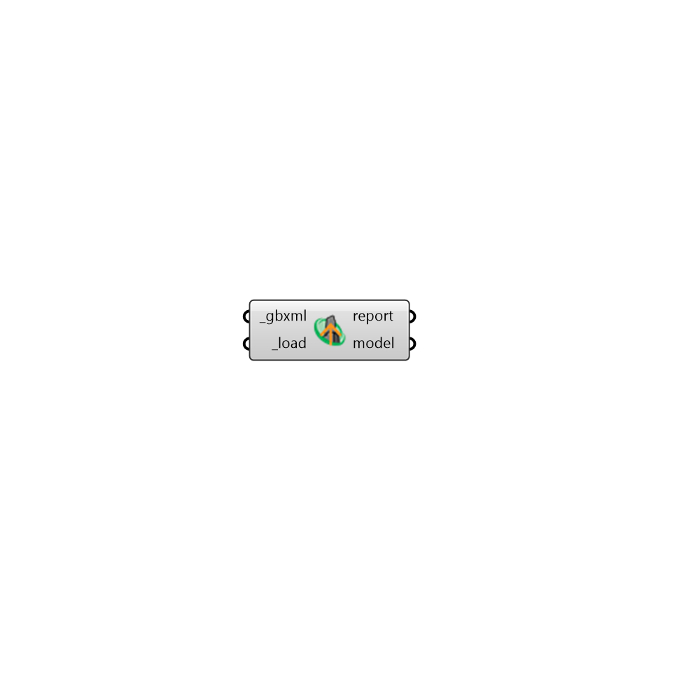

## Load gbXML

 - [[source code]](https://github.com/ladybug-tools/honeybee-grasshopper-core/blob/master/ladybug_grasshopper/src//HB%20Load%20gbXML.py)

Load a gbXML, OSM, or IDF file as a Honeybee Model. 

The reverse translators within the OpenStudio SDK are used to import all geometry and boundary conditions (including adjacencies) to a Honeybee format. 

Note that, while all geometry will be imported, it is possible that not all of the properties assigned to this geometry will be imported, particularly if a certain property is not supported in the OpenStudio SDK. Honeybee will assign defaults for missing properites and, the HBJSON format should be used whenever lossless file transfer is needed. 

#### Inputs
* ##### gbxml [Required]
A file path to a gbXML, OSM or IDF file from which a Honeybee Model will be loaded 
* ##### load [Required]
Set to "True" to load the Model from the input file. 

#### Outputs
* ##### report
... 
* ##### model
A honeybee Model objects that has been re-serialized from the input file. 