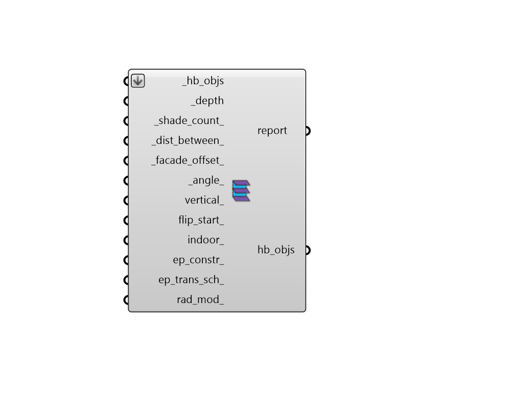

## Louver Shades

 - [[source code]](https://github.com/ladybug-tools/honeybee-grasshopper-core/blob/master/ladybug_grasshopper/src//HB%20Louver%20Shades.py)

Add louverd Shades, overhangs or fins to all the outdoor Apertures of an input Room, Face or Aperture. 

Note that, if a Face or Room is input, Shades will only be added to those Faces that are Walls (not Floors or Roofs). 

#### Inputs
* ##### hb_objs [Required]
A list of honeybee Rooms, Faces, or Apertures to which louver shades will be added. 
* ##### depth [Required]
A number for the depth to extrude the louvers. If an array of values are input here, different depths will be assigned based on cardinal direction, starting with north and moving clockwise. 
* ##### shade_count 
A positive integer for the number of louvers to generate. If there is an input below for _dist_between_, an attempt will still be made to meet the _shade_count_ but, if there are more shades than can fit on the input hb_obj, the number of shades will be truncated. If an array of values are input here, different shade counts will be assigned based on cardinal direction, starting with north and moving clockwise. (Default: 1). 
* ##### dist_between 
A number for the approximate distance between each louver. If an array of values are input here, different distances between louvers will be assigned based on cardinal direction, starting with north and moving clockwise. 
* ##### facade_offset 
A number for the distance from the louver edge to the facade. If an array of values are input here, different offsets will be assigned based on cardinal direction, starting with north and moving clockwise. (Default: 0). 
* ##### angle 
A number for the for an angle to rotate the louvers in degrees. If an array of values are input here, different angles will be assigned based on cardinal direction, starting with north and moving clockwise. (Default: 0). 
* ##### vertical 
Optional boolean to note whether the lovers are vertical. If False, the louvers will be horizontal. If an array of values are input here, different vertical booleans will be assigned based on cardinal direction, starting with north and moving clockwise. (Default: False). 
* ##### flip_start 
Optional boolean to note whether the side the louvers start from should be flipped. If False, louvers will be generated starting on top or the right side. If True, louvers will start from the bottom or left. If an array of values are input here, different flip start booleans will be assigned based on cardinal direction, starting with north and moving clockwise. Default: False. 
* ##### indoor 
Optional boolean for whether louvers should be generated facing the opposite direction of the aperture normal and added to the Aperture's indoor_shades instead of outdoor_shades. If an array of values are input here, different indoor booleans will be assigned based on cardinal direction, starting with north and moving clockwise. Note that, by default, indoor shades are not used in energy simulations but they are used in all simulations involving Radiance. (Default: False). 
* ##### ep_constr 
Optional Honeybee ShadeConstruction to be applied to the input _hb_objs. This can also be text for a construction to be looked up in the shade construction library. If an array of text or construction objects are input here, different constructions will be assigned based on cardinal direction, starting with north and moving clockwise. 
* ##### rad_mod 
Optional Honeybee Modifier to be applied to the input _hb_objs. This can also be text for a modifier to be looked up in the shade modifier library. If an array of text or modifier objects are input here, different modifiers will be assigned based on cardinal direction, starting with north and moving clockwise. 

#### Outputs
* ##### report
Reports, errors, warnings, etc. 
* ##### hb_objs
The input Honeybee Face or Room or Aperture with louvered shades added to it. 