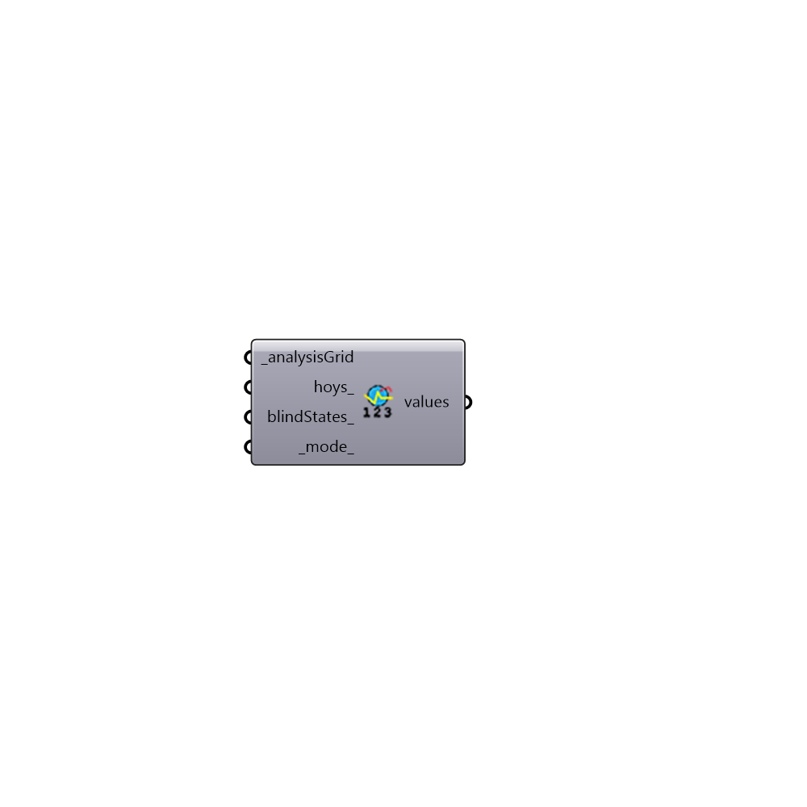

##  Maximum Value

Maximum values for a grid.
 -

#### Inputs
* ##### analysisGrid [Required]
An analysis grid output from run Radiance analysis.
* ##### hoys [Optional]
An optional list of hours for hours of the year if you don't want
 the analysis to be calculated for all the hours.
* ##### blindStates [Optional]
A list of blind states for light sources as tuples for
 hours of the year. You can use Dynamic Blinds Schedule component
 to generate this schedule. If left empty the first state of each
 window group will be used.
* ##### mode [Default]
An integer between 0-2. 0 returns that total values, 1 returns
 diret values if available and 2 returns sky + diffuse values if
 available.

#### Outputs
* ##### values
A list of maximum values for each sensor.

[Check Hydra Example Files for Maximum Value](https://hydrashare.github.io/hydra/index.html?keywords=HoneybeePlus_Maximum Value)