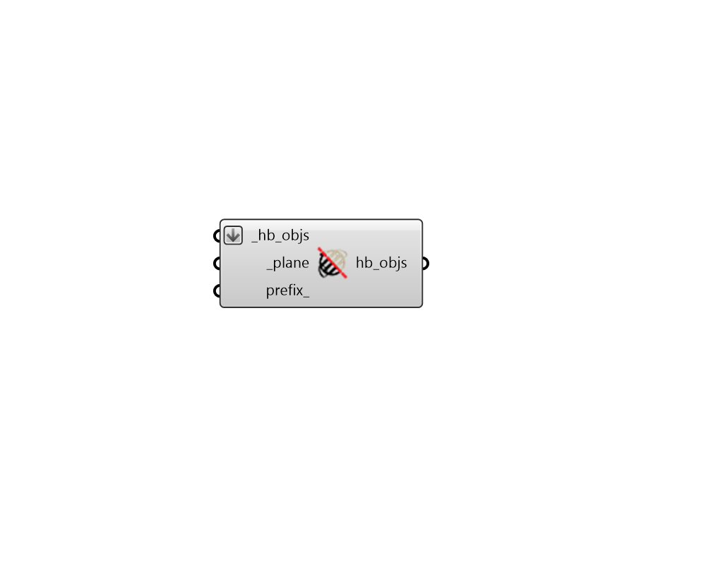

## Mirror

 - [[source code]](https://github.com/ladybug-tools/honeybee-grasshopper-core/blob/master/ladybug_grasshopper/src//HB%20Mirror.py)

Mirror any Honeybee geometry object or a Model across a plane. 

#### Inputs
* ##### hb_objs [Required]
Any Honeybee geometry object (eg. Room, Face, Aperture, Door or Shade) to be mirrored across a plane. This can also be a Honeybee Model object to be mirrored. 
* ##### plane [Required]
A Plane across which the object will be mirrored. 
* ##### prefix 
Optional text string that will be inserted at the start of the identifiers and display names of all transformed objects, their child objects, and their adjacent Surface boundary condition objects. This is particularly useful in workflows where you duplicate and edit a starting object and then want to combine it with the original object into one Model (like making a model of repeated rooms) since all objects within a Model must have unique identifiers. It is recommended that this prefix be short to avoid maxing out the 100 allowable characters for honeybee identifiers. If None, no prefix will be added to the input objects and all identifiers and display names will remain the same. Default: None. 

#### Outputs
* ##### hb_objs
The input _hb_objs that has been mirrored across the input plane. 