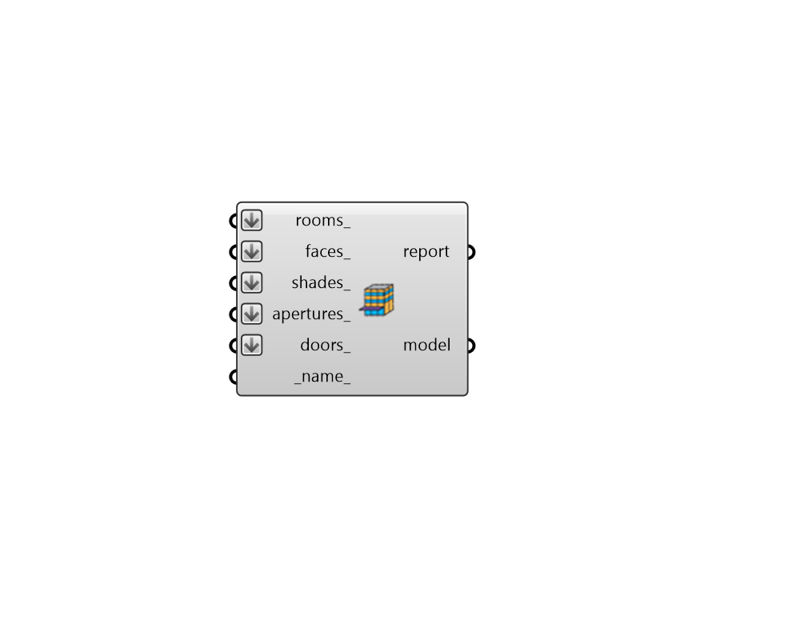

## Model

 - [[source code]](https://github.com/ladybug-tools/honeybee-grasshopper-core/blob/master/honeybee_grasshopper_core/src//HB%20Model.py)

Create a Honeybee Model, which can be sent for simulation. 

#### Inputs
* ##### rooms 
A list of honeybee Rooms to be added to the Model. Note that at least one Room is necessary to make a simulate-able energy model. 
* ##### faces 
A list of honeybee Faces to be added to the Model. Note that faces without a parent Room are not allowed for energy models. 
* ##### shades 
A list of honeybee Shades to be added to the Model. 
* ##### apertures 
A list of honeybee Apertures to be added to the Model. Note that apertures without a parent Face are not allowed for energy models. 
* ##### doors 
A list of honeybee Doors to be added to the Model. Note that doors without a parent Face are not allowed for energy models. 
* ##### name 
Text to be used for the Model name and to be incorporated into a unique model identifier. If no name is provided, it will be "unnamed" and a unique model identifier will be auto-generated. 

#### Outputs
* ##### report
Reports, errors, warnings, etc. 
* ##### model
A Honeybee Model object possessing all of the input geometry objects. 