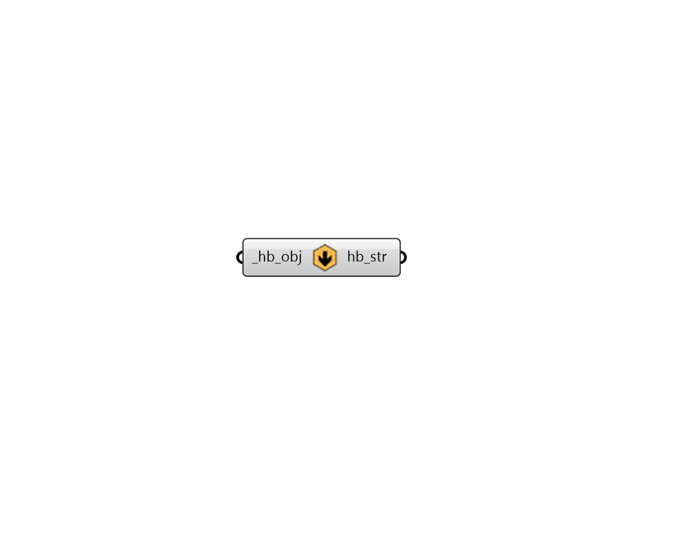

## Object to String

 - [[source code]](https://github.com/ladybug-tools/honeybee-grasshopper-core/blob/master/honeybee_grasshopper_core/src//HB%20Object%20to%20String.py)

Serialize any honeybee object to a JSON text string. You can use "HB String to Object" component to load the objects from the file back. 

Honeybee objects include any honeybee energy Material, Construction, ConstructionSet, Schedule, Load, ProgramType, or Simulation object. 

#### Inputs
* ##### hb_obj [Required]
A Honeybee object to be serialized to a string. 

#### Outputs
* ##### hb_str
A text string that completely describes the honeybee object. This can be serialized back into a honeybee object using the "HB String to Object" coponent. 