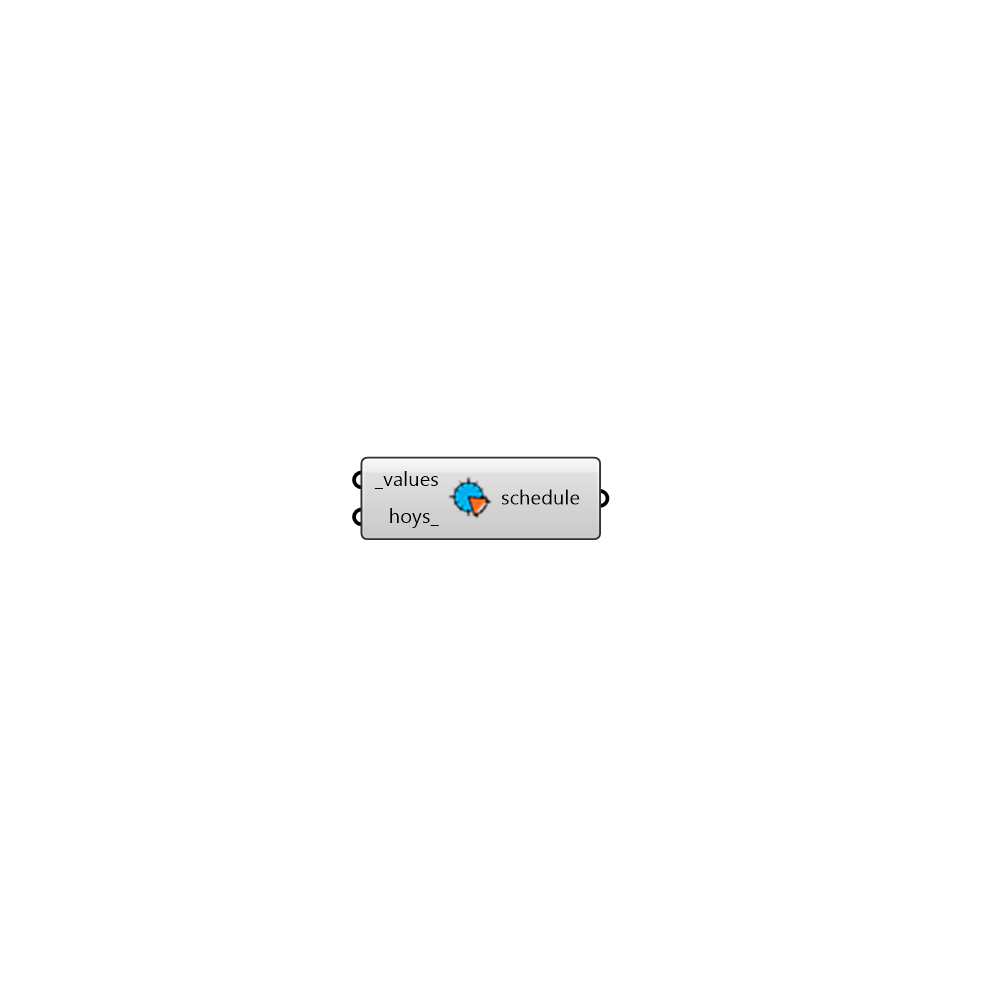

##  Occupancy Schedule - [[source code]](https://github.com/ladybug-tools/honeybee-grasshopper/tree/master/plugin/grasshopper/src/HoneybeePlus_Occupancy%20Schedule.py)

Occupancy Schedule from hourly values.
 -

#### Inputs
* ##### values [Required]
Schedule values.
* ##### hoys [Optional]
List of hours of the year for this values (default: 0-8759).

#### Outputs
* ##### schedule
Honeybee Schedule.

[Check Hydra Example Files for Occupancy Schedule](https://hydrashare.github.io/hydra/index.html?keywords=HoneybeePlus_Occupancy Schedule)