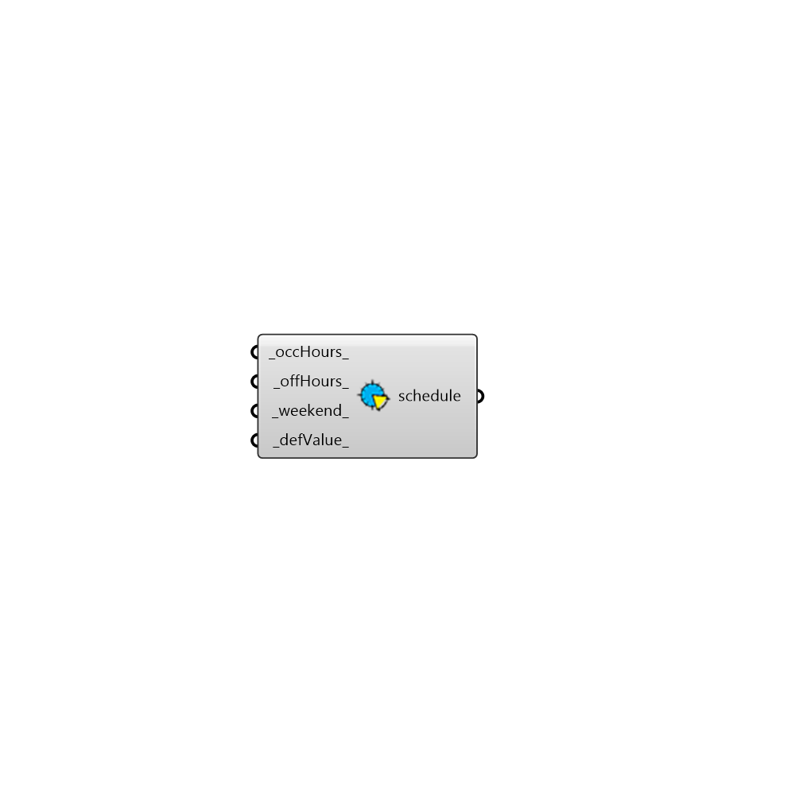

##  Occupancy Schedule from Week

Typical Occupancy Schedule based on typical week.
 -

#### Inputs
* ##### occHours [Default]
Start and end hour of work day as a tuple. Default is (8, 17).
* ##### offHours [Default]
A list of hours that building is unoccupied during the occupancy
 period everyday (e.g. lunch break). Default is an hour lunch break at
 (12, 13). Use -1 for no break during the day.
* ##### weekend [Default]
A list of numbers to indicate the weekend days. [0] None, [1-7] MON
 to SUN. Default is 6, 7 (SAT, SUN).
* ##### defValue [Default]
Default value for occupancy hours (Default: 1).

#### Outputs
* ##### schedule
Annual schedule.

[Check Hydra Example Files for Occupancy Schedule from Week](https://hydrashare.github.io/hydra/index.html?keywords=HoneybeePlus_Occupancy Schedule from Week)