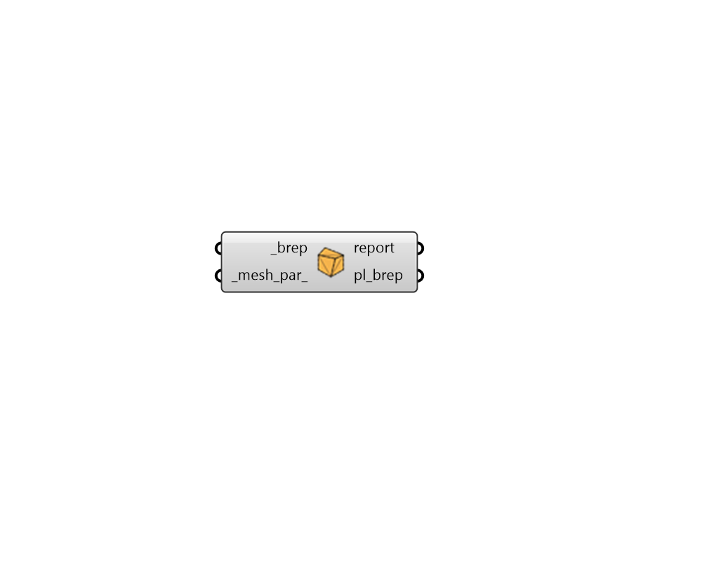

## Planarize Brep

 - [[source code]](https://github.com/ladybug-tools/honeybee-grasshopper-core/blob/master/ladybug_grasshopper/src//HB%20Planarize%20Brep.py)

Planarize Rhino breps in a manner that allows control over the meshing process. 

The resulting planar breps will be solid if the input brep is solid and any planar faces of the brep will remain unchanged except for the polygonization of curved edges. 

#### Inputs
* ##### brep [Required]
A list of closed Rhino polysurfaces (aka. breps) to be planarized. 
* ##### mesh_par 
Optional Rhino Meshing Parameters to describe how curved faces should be convereted into planar elements. These can be obtained from the native Grasshopper mesh Settings components. If None, Rhino's Default Meshing Parameters will be used, which tend to be very coarse and simple. 

#### Outputs
* ##### report
Reports, errors, warnings, etc. 
* ##### pl_brep
A planar version of the input _brep. 