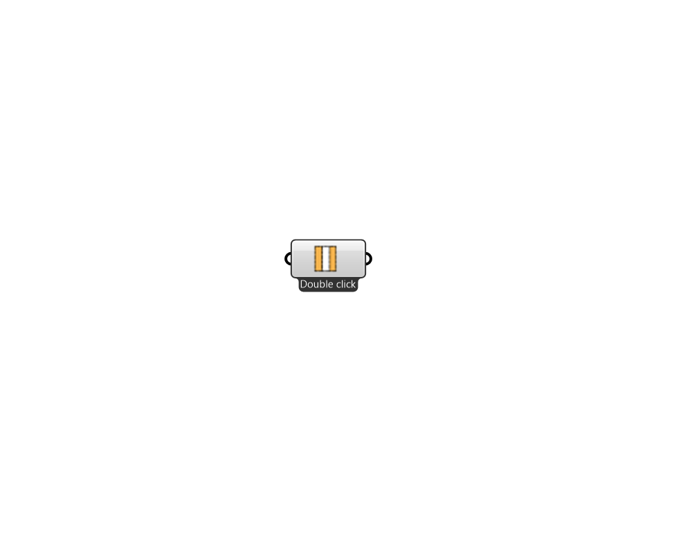

## Pollination Construction

 - [[source code]](https://github.com/ladybug-tools/honeybee-grasshopper-core/blob/master/honeybee_grasshopper_core/src//Pollination%20Construction.py)

Creates a list of Honeybee constructions. Right click on the icon/name of the component to access menù. 

#### Inputs

#### Outputs