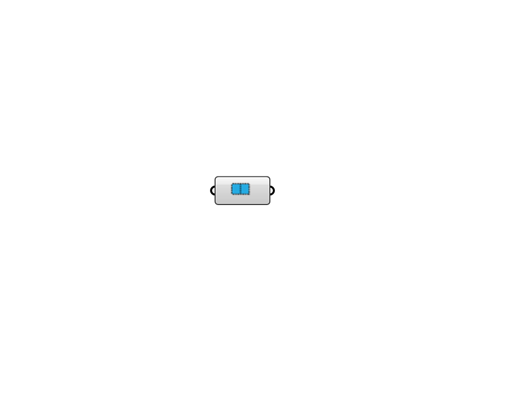

## Pollination Orphaned Aperture

 - [[source code]](https://github.com/ladybug-tools/honeybee-grasshopper-core/blob/master/honeybee_grasshopper_core/src//Pollination%20Orphaned%20Aperture.py)

Select Orphaned Apertures from Pollination to use with Honeybee. Features: A - Convert Pollination Apertures into Honeybee Shades; B - Internalise selected Pollination Apertures; C - Bake Pollination Apertures; D - Bake volatile Honeybee Apertures; E - Save Pollination Shade identifiers if Internalised data is disabled. Right click on the icon/name of the component to access menù. 

#### Inputs

#### Outputs