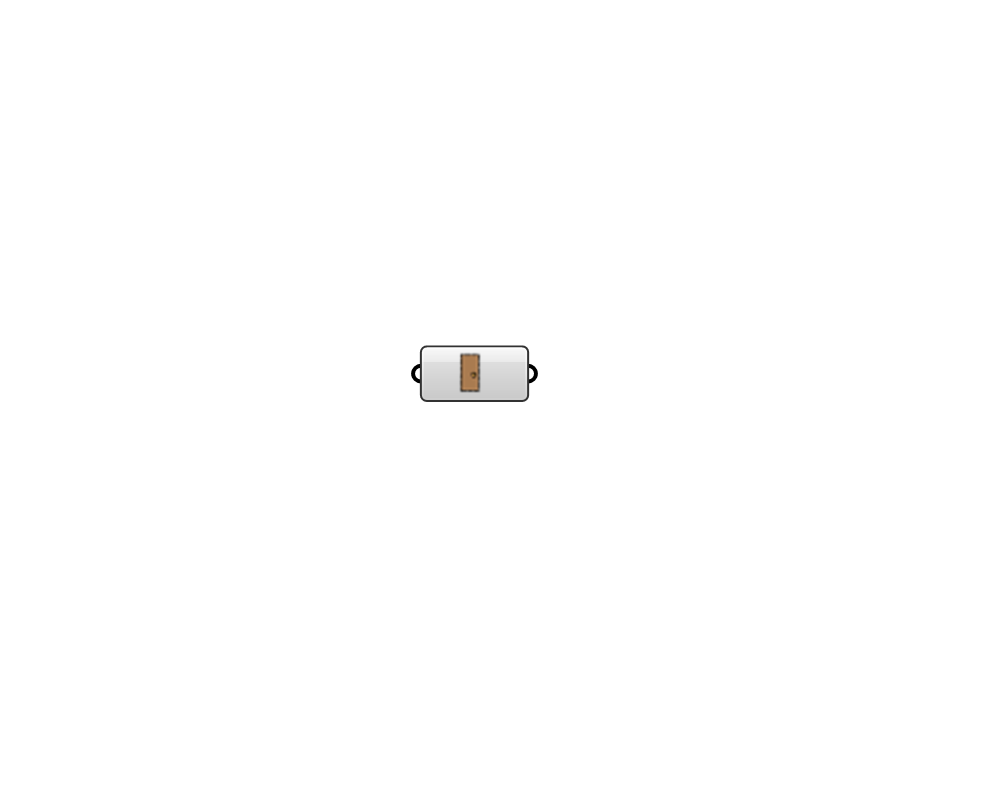

## Pollination Orphaned Door

 - [[source code]](https://github.com/ladybug-tools/honeybee-grasshopper-core/blob/master/honeybee_grasshopper_core/src//Pollination%20Orphaned%20Door.py)

Select Orphaned Doors from Pollination to use with Honeybee. Features: A - Convert Pollination Doors into Honeybee Doors; B - Internalise selected Pollination Doors; C - Bake Pollination Doors; D - Bake volatile Honeybee Doors; E - Save Pollination Shade identifiers if Internalised data is disabled. Right click on the icon/name of the component to access menù. 

#### Inputs

#### Outputs