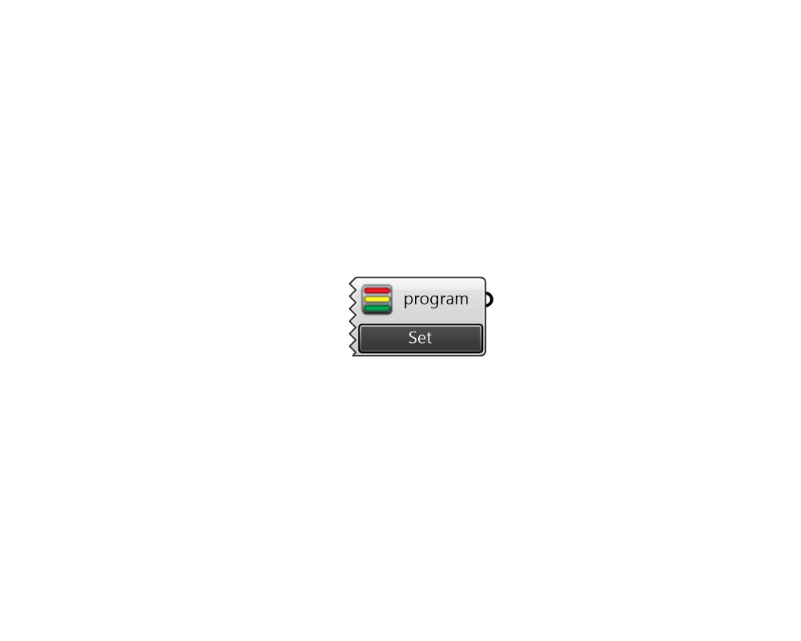

## Pollination ProgramType

 - [[source code]](https://github.com/ladybug-tools/honeybee-grasshopper-core/blob/master/honeybee_grasshopper_core/src//Pollination%20ProgramType.py)

Creates a list of standard openstudio program_types to use with Honeybee. 

#### Inputs

#### Outputs
* ##### program
ProgramType. 