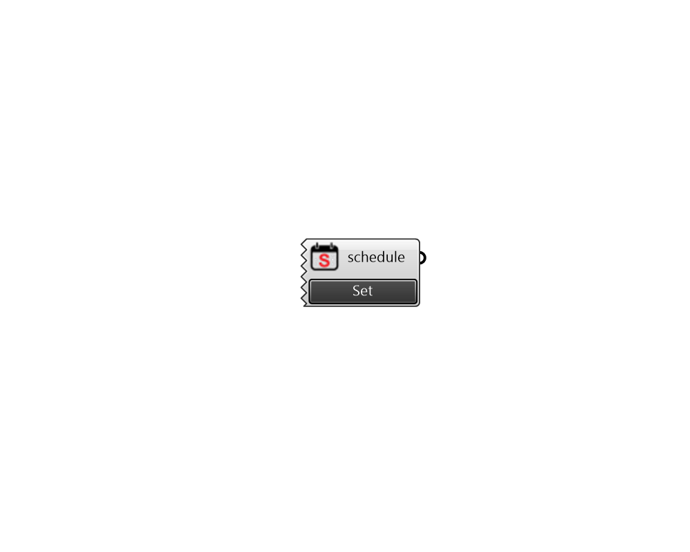

## Pollination Schedule

 - [[source code]](https://github.com/ladybug-tools/honeybee-grasshopper-core/blob/master/honeybee_grasshopper_core/src//Pollination%20Schedule.py)

Creates a Honeybee schedule. 

#### Inputs

#### Outputs
* ##### schedule
Schedule 