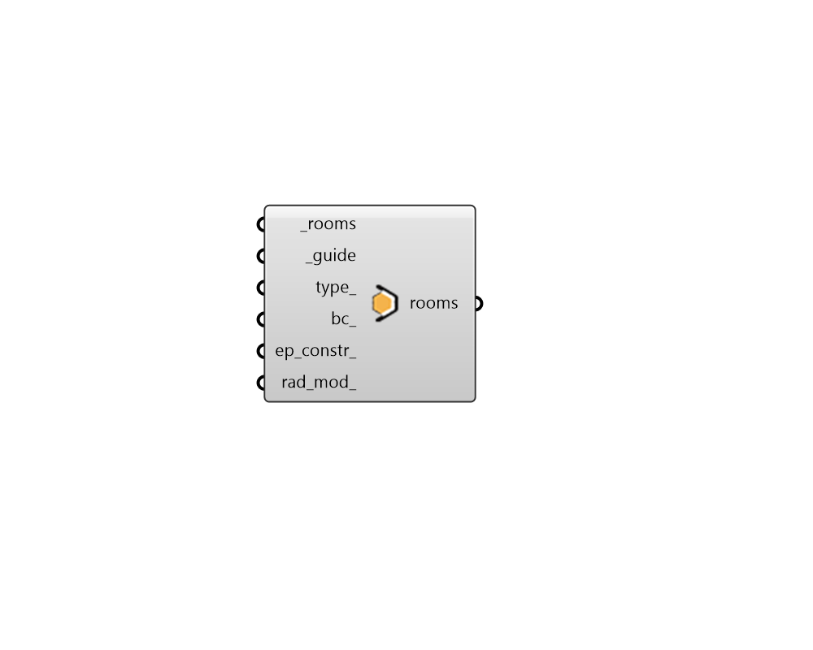

## Properties by Guide Surface

 - [[source code]](https://github.com/ladybug-tools/honeybee-grasshopper-core/blob/master/ladybug_grasshopper/src//HB%20Properties%20by%20Guide%20Surface.py)

Set the properties of room Faces using (a) guide surface(s) or polysurface(s). 

Faces that are touching and coplanar with the guide surface will get their properties changed to match the inputs. 

This is useful for colelctively setting the properties of spatially aligned Faces, like setting Faces along a given stretch of a parti wall to be adiabatic. 

#### Inputs
* ##### rooms [Required]
Honeybee Rooms which will have their Face boundary conditions set based on the guide surface(s). 
* ##### guide [Required]
Rhino Breps or Meshes that represent the guide surfaces. 
* ##### type 
Text for the face type. The face type will be used to set the material and construction for the surface if they are not assigned through the inputs below. Choose from the following: 

    - Wall

    - RoofCeiling

    - Floor

    - AirBoundary
* ##### bc 
Text for the boundary condition of the face. The boundary condition is also used to assign default materials and constructions as well as the nature of heat excahnge across the face in energy simulation. Choose from the following: 

    - Outdoors

    - Ground

    - Adiabatic
* ##### ep_constr 
Optional text for the Face's energy construction to be looked up in the construction library. This can also be a custom OpaqueConstruction object. 
* ##### rad_mod 
Optional text for the Face's radiance modifier to be looked up in the modifier library. This can also be a custom modifier object. 

#### Outputs
* ##### rooms
The input Rooms with their Face properties changed. 