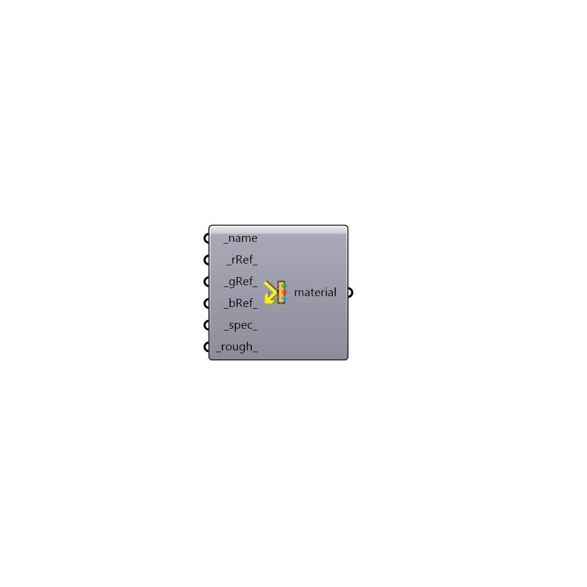

##  Radiance Opaque Material 3 - [[source code]](https://github.com/ladybug-tools/honeybee-grasshopper/tree/master/plugin/grasshopper/src/HoneybeePlus_Radiance%20Opaque%20Material%203.py)

Radiance Opaque Material from Single Reflectance Value
 -

#### Inputs
* ##### name [Required]
Material name
* ##### rRef [Default]
Diffuse reflectance for red channel
* ##### gRef [Default]
Diffuse reflectance for green channel
* ##### bRef [Default]
Diffuse reflectance for blue channel
* ##### spec [Default]
Specularity values above 0.1 are uncommon
* ##### rough [Default]
Roughness values above 0.2 are uncommon

#### Outputs
* ##### material
Radiance opaque material

[Check Hydra Example Files for Radiance Opaque Material 3](https://hydrashare.github.io/hydra/index.html?keywords=HoneybeePlus_Radiance Opaque Material 3)