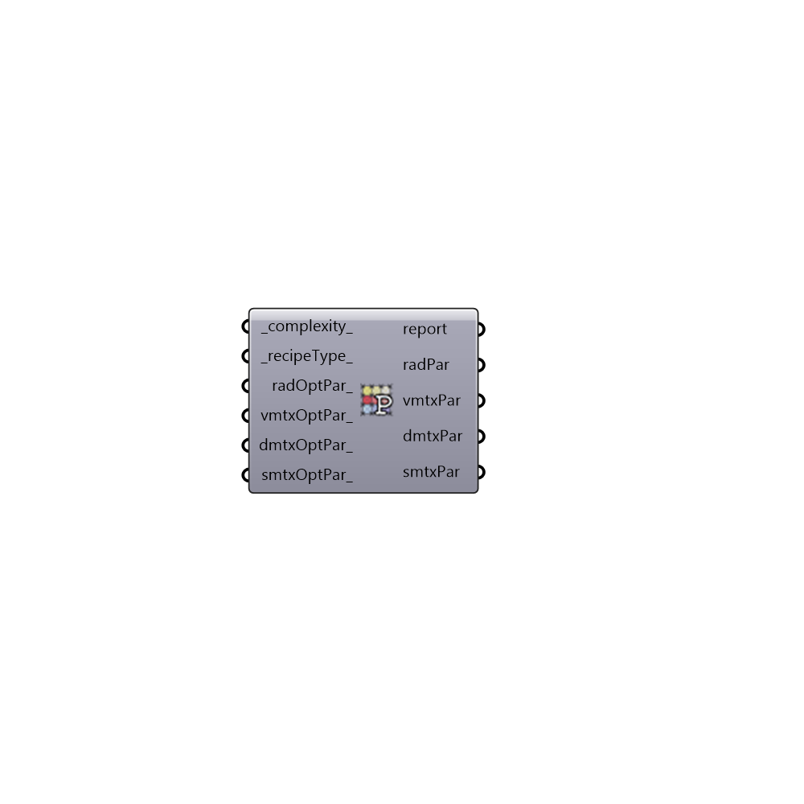

##  Radiance Parameters Grid-based - [[source code]](https://github.com/ladybug-tools/honeybee-grasshopper/tree/master/plugin/grasshopper/src/HoneybeePlus_Radiance%20Parameters%20Grid-based.py)

Radiance parameters library for analysis recipes.
 Check here for more details: http://radsite.lbl.gov/radiance/refer/Notes/rpict_options.html
 Read more about the parameters at: http://daysim.ning.com/
 Here is my favorite presentation by John Mardaljevic: http://radiance-online.org/community/workshops/2011-berkeley-ca/presentations/day1/JM_AmbientCalculation.pdf
 -

#### Inputs
* ##### complexity [Default]
0 > low, 1 > Medium, 2 > High (default: 0).
* ##### recipeType [Default]
0 > Point-in-time, 1 > Daylight Coeff., 2 > 3Phase, 3 > 5Phase
* ##### radOptPar [Optional]
Use this input to set other Radiance parameters as needed.
 You must follow Radiance's standard syntax (e.g. -ps 1 -lw 0.01)
* ##### vmtxOptPar [Optional]
Use this input to set other Radiance parameters for view matrix
 calculation as needed. You must follow Radiance's standard syntax
 (e.g. -ps 1 -lw 0.01).
* ##### dmtxOptPar [Optional]
Use this input to set other Radiance parameters for daylight
 matrix calculation as needed. You must follow Radiance's standard syntax
 (e.g. -ps 1 -lw 0.01).
* ##### smtxOptPar [Optional]
Use this input to set other Radiance parameters for sun
 matrix calculation as needed. You must follow Radiance's standard syntax
 (e.g. -ps 1 -lw 0.01).

#### Outputs
* ##### report
The execution information, as output and error streams
* ##### radPar
Radiance parameters.
* ##### vmtxPar
Radiance parameters for view matrix calculation.
* ##### dmtxPar
Radiance parameters for daylight matrix calculation.
* ##### smtxPar
Radiance parameters for direct sun matrix calculation.

[Check Hydra Example Files for Radiance Parameters Grid-based](https://hydrashare.github.io/hydra/index.html?keywords=HoneybeePlus_Radiance Parameters Grid-based)