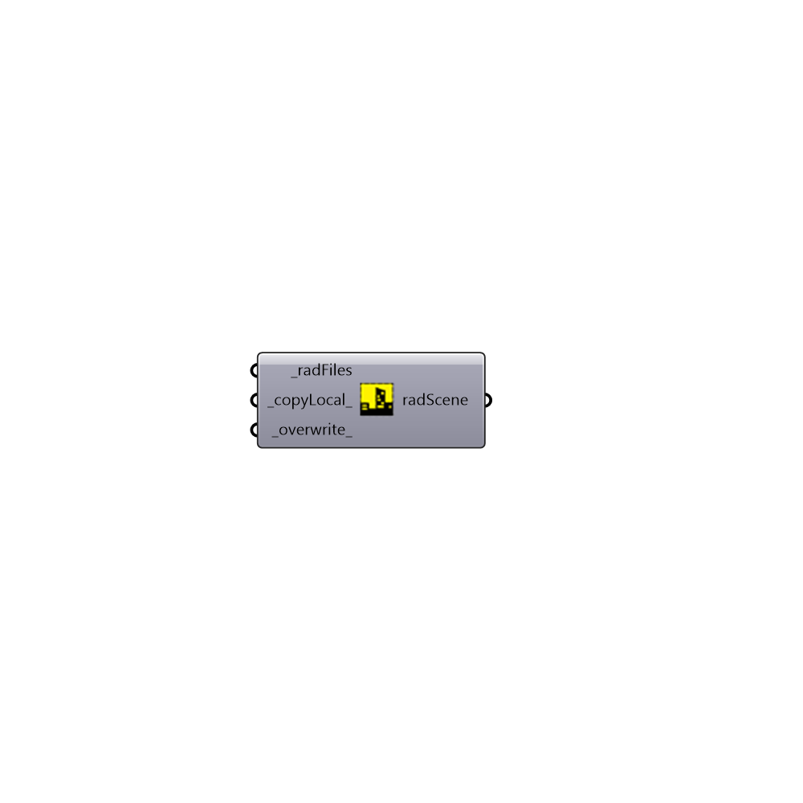

##  Radiance Scene - [[source code]](https://github.com/ladybug-tools/honeybee-grasshopper/tree/master/plugin/grasshopper/src/HoneybeePlus_Radiance%20Scene.py)

Radiance Scene.
 Use this class to create a base for the radiance studies by using a number
 of radiance files. The main advantage of creating a scene is to avoid re-creating
 the geometries and writing the files in parametric studies.
 -

#### Inputs
* ##### radFiles [Required]
List of radiance files. Valid files are *.rad, *.mat and *.oct.
* ##### copyLocal [Default]
Set to True to copy the files to the analysis folder (Default: True).
* ##### overwrite [Default]
Set to True to overwrite the files if already exist (Default: True).

#### Outputs
* ##### radScene
Script variable Python

[Check Hydra Example Files for Radiance Scene](https://hydrashare.github.io/hydra/index.html?keywords=HoneybeePlus_Radiance Scene)