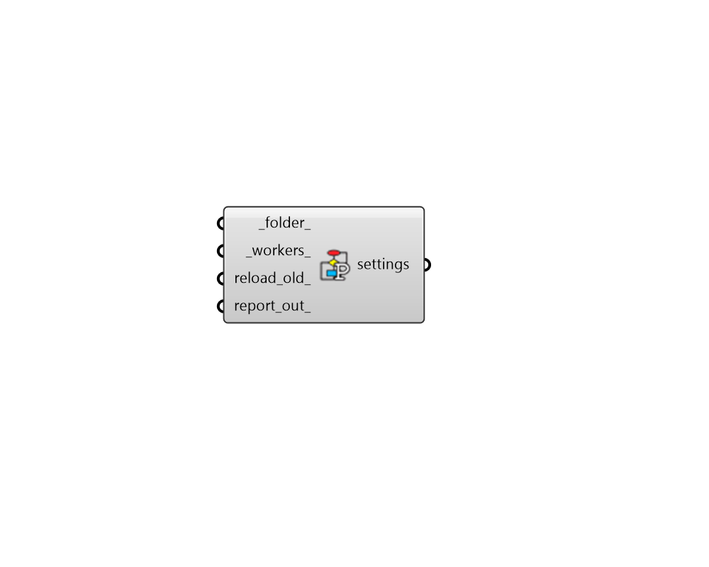

## Recipe Settings

 - [[source code]](https://github.com/ladybug-tools/honeybee-grasshopper-core/blob/master/honeybee_grasshopper_core/src//HB%20Recipe%20Settings.py)

Specify settings for the run of a recipe, including the number of workers/CPUs, the project folder, and other settings. 

#### Inputs
* ##### folder 
Path to a project folder in which the recipe will be executed. If None, the default project folder for the Recipe will be used. 
* ##### workers 
An integer to set the number of CPUs used in the execution of the recipe. This number should not exceed the number of CPUs on the machine and should be lower if other tasks are running while the simulation is running. If unspecified, it will automatically default to one less than the number of CPUs currently available on the machine. (Default: None) 
* ##### reload_old 
A boolean to indicate whether existing results for a given model and recipe should be reloaded (if they are found) instead of re-running the entire recipe from the beginning. If False or None, any existing results will be overwritten by the new simulation. 
* ##### debug_folder 
An optional path to a debug folder. If debug folder is provided, all the steps of the simulation will be executed inside the debug folder which can be used for further inspection. 

#### Outputs
* ##### settings
Recipe settings that can be plugged into any recipe component to specify how the simulation should be run. 