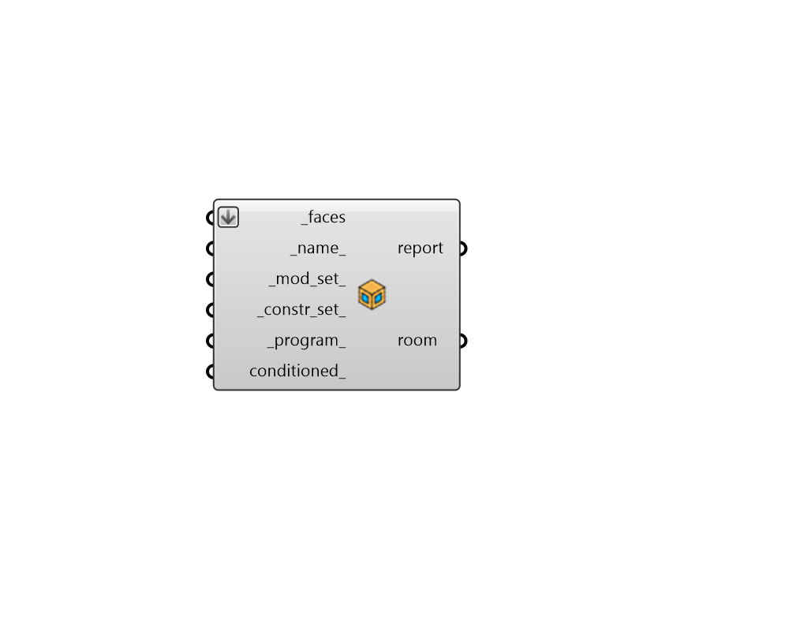

## Room

 - [[source code]](https://github.com/ladybug-tools/honeybee-grasshopper-core/blob/master/ladybug_grasshopper/src//HB%20Room.py)

Create Honeybee Room from Honeybee Faces. 

Note that each Room is mapped to a single zone in EnergyPlus/OpenStudio and should always be a closed volume to ensure correct volumetric calculations and avoid light leaks in Radiance simulations. 

#### Inputs
* ##### faces [Required]
A list of honeybee Faces to be joined together into a Room. 
* ##### name 
Text to set the name for the Room and to be incorporated into unique Room identifier. If the name is not provided, a random name will be assigned. 
* ##### mod_set 
Text for the modifier set of the Room, which is used to assign all default radiance modifiers needed to create a radiance model. Text should refer to a ModifierSet within the library) such as that output from the "HB List Modifier Sets" component. This can also be a custom ModifierSet object. If nothing is input here, the Room will have a generic construction set that is not sensitive to the Room's climate or building energy code. 
* ##### constr_set 
Text for the construction set of the Room, which is used to assign all default energy constructions needed to create an energy model. Text should refer to a ConstructionSet within the library) such as that output from the "HB List Construction Sets" component. This can also be a custom ConstructionSet object. If nothing is input here, the Room will have a generic construction set that is not sensitive to the Room's climate or building energy code. 
* ##### program 
Text for the program of the Room (to be looked up in the ProgramType library) such as that output from the "HB List Programs" component. This can also be a custom ProgramType object. If no program is input here, the Room will have a generic office program. Note that ProgramTypes effectively map to OpenStudio space types upon export to OpenStudio. 
* ##### conditioned 
Boolean to note whether the Room has a heating and cooling system. 

#### Outputs
* ##### report
Reports, errors, warnings, etc. 
* ##### room
Honeybee room. These can be used directly in energy and radiance simulations. 