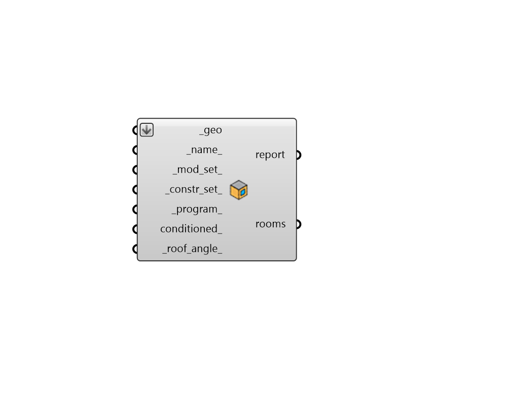

## Room from Solid

 - [[source code]](https://github.com/ladybug-tools/honeybee-grasshopper-core/blob/master/honeybee_grasshopper_core/src//HB%20Room%20from%20Solid.py)

Create Honeybee Rooms from solids (closed Rhino polysurfaces). 

Note that each Room is mapped to a single zone in EnergyPlus/OpenStudio and should always be a closed volume to ensure correct volumetric calculations and avoid light leaks in Radiance simulations. 

#### Inputs
* ##### geo [Required]
A list of closed Rhino polysurfaces (aka.breps) to be converted into honeybee Rooms. This list can also include closed meshes that represent the rooms. 
* ##### name 
Text to set the base name for the Room, which will also be incorporated into unique Room identifier. If the name is not provided, a random name will be assigned. 
* ##### mod_set 
Text for the modifier set of the Rooms, which is used to assign all default radiance modifiers needed to create a radiance model. Text should refer to a ModifierSet within the library) such as that output from the "HB List Modifier Sets" component. This can also be a custom ModifierSet object. If nothing is input here, the Room will have a generic construction set that is not sensitive to the Room's climate or building energy code. 
* ##### constr_set 
Text for the construction set of the Rooms, which is used to assign all default energy constructions needed to create an energy model. Text should refer to a ConstructionSet within the library such as that output from the "HB List Construction Sets" component. This can also be a custom ConstructionSet object. If nothing is input here, the Rooms will have a generic construction set that is not sensitive to the Rooms's climate or building energy code. 
* ##### program 
Text for the program of the Rooms (to be looked up in the ProgramType library) such as that output from the "HB List Programs" component. This can also be a custom ProgramType object. If no program is input here, the Rooms will have a generic office program. Note that ProgramTypes effectively map to OpenStudio space types upon export to OpenStudio. 
* ##### conditioned 
Boolean to note whether the Rooms have heating and cooling systems. 
* ##### roof_angle 
A number between 0 and 90 to set the angle from the horizontal plane below which faces will be considered roofs or floors instead of walls. 90 indicates that all vertical faces are roofs and 0 indicates that all horizontal faces are walls. The default value of 60 degrees is the recommended value given by the ASHRAE 90.1 standard. (Default: 60). 

#### Outputs
* ##### report
Reports, errors, warnings, etc. 
* ##### rooms
Honeybee rooms. These can be used directly in energy and radiance simulations. 