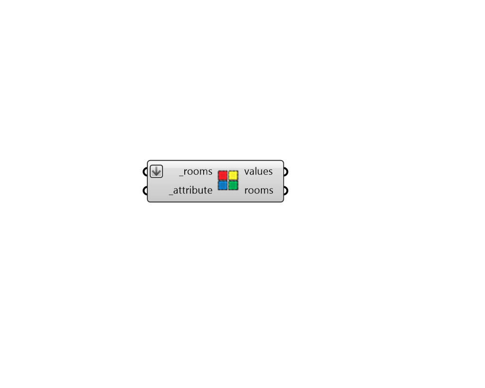

## Rooms by Attribute

 - [[source code]](https://github.com/ladybug-tools/honeybee-grasshopper-core/blob/master/ladybug_grasshopper/src//HB%20Rooms%20by%20Attribute.py)

Separate and group honeybee Rooms by any attribute that the room possesses. 

This can be used to group rooms by program, whether rooms are conditioned, etc. 

#### Inputs
* ##### rooms [Required]
An array of honeybee Rooms or honeybee Models to be separated and grouped based on their attributes. 
* ##### attribute [Required]
Text for the name of the Room attribute with which the Rooms should be labeled. The Honeybee "Room Attributes" component lists all of the core attributes of the room. Also, each Honeybee extension (ie. Radiance, Energy) includes its own component that lists the Room attributes of that extension. 

#### Outputs
* ##### values
A list of values with one attribute value for each branch of the output rooms. 
* ##### rooms
A data tree of honeybee rooms with each branch of the tree representing a different attribute value. 