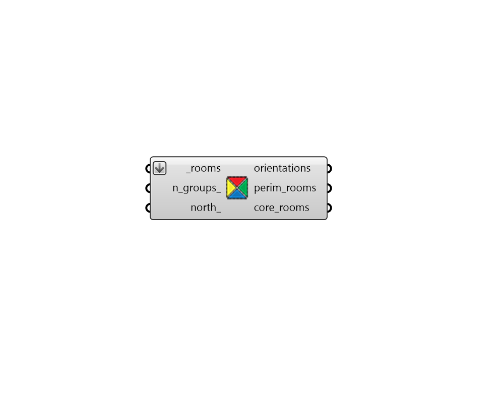

## Rooms by Orientation

 - [[source code]](https://github.com/ladybug-tools/honeybee-grasshopper-core/blob/master/ladybug_grasshopper/src//HB%20Rooms%20by%20Orientation.py)

Separate and group honeybee rooms with the same average orientation of walls with an Outdoors boundary condition. 

#### Inputs
* ##### rooms [Required]
A list of honeybee honeybee Rooms or honeybee Models to be separated by orientation. 
* ##### n_groups 
An optional positive integer to set the number of orientation groups to use. For example, setting this to 4 will result in rooms being grouped by four orientations (North, East, South, West). If None, the maximum number of unique groups will be used. 
* ##### north 
A number between 0 and 360 to set the clockwise north direction in degrees. This can also be a vector to set the North. Default is 0. 

#### Outputs
* ##### orientations
A list of numbers between 0 and 360 with one orientation for each branch of the output perim_rooms. This will be a list of angle ranges if a value is input for n_groups_. 
* ##### perim_rooms
A data tree of honeybee rooms with each branch of the tree representing a different orientation. 
* ##### core_rooms
A list of honeybee rooms with no identifiable orientation. 