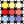
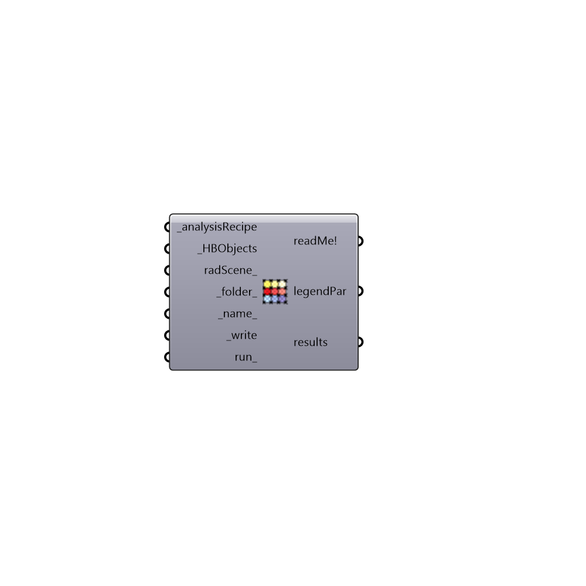

##  Run Radiance Analysis - [[source code]](https://github.com/ladybug-tools/honeybee-grasshopper/tree/master/plugin/grasshopper/src/HoneybeePlus_Run%20Radiance%20Analysis.py)

Run Radiance Analysis
 -

#### Inputs
* ##### analysisRecipe [Required]
Radiance analysis recipe. You can find the recipes under
 tab 03 | Daylight | Recipe.
* ##### HBObjects [Required]
A flatten list of Honeybee surfaces and zones.
* ##### radScene [Optional]
A honeybee radiance scene that will be considered as the context
 for honeybee objects. Use Radiance Scene component to create a radScene.
* ##### folder [Default]
An optional folder to save the files for this analysis.
* ##### name [Default]
An optional name for this analysis.
* ##### write [Required]
Set to True to write the files to the folder.
* ##### run [Optional]
Set to True to run the analysis. You can only run the analysis if
 _write is also set to True.

#### Outputs
* ##### report
Reports, errors, warnings, etc.
* ##### legendPar
Suggested legend parameters based on the recipe.
* ##### outputs
Outputs of the analysis. Outputs can be a list of image
 collections or a list of analysis grids.

[Check Hydra Example Files for Run Radiance Analysis](https://hydrashare.github.io/hydra/index.html?keywords=HoneybeePlus_Run Radiance Analysis)