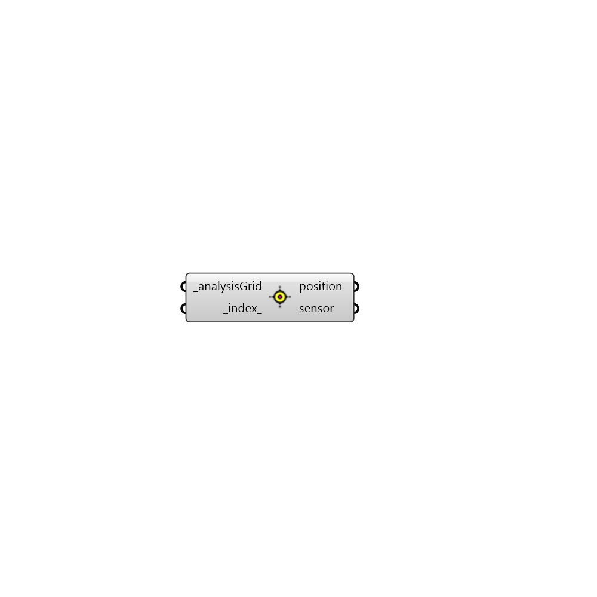

##  Sensor from analysis grid

Sensor from analysis grid
 -

#### Inputs
* ##### analysisGrid [Required]
An analysis grid output from run Radiance analysis.
* ##### index [Default]
An integer to pick the sensor from the analysis grid (default: 0).

#### Outputs
* ##### position
Position of the sensor
* ##### sensor
Sensor object. Use this sensor to generate blind schedules for
 annual daylight analysis.

[Check Hydra Example Files for Sensor from analysis grid](https://hydrashare.github.io/hydra/index.html?keywords=HoneybeePlus_Sensor from analysis grid)