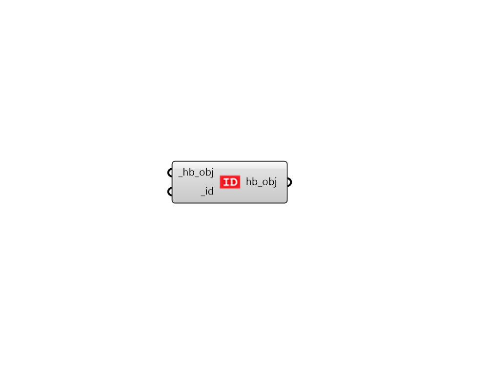

## Set Identifier

 - [[source code]](https://github.com/ladybug-tools/honeybee-grasshopper-core/blob/master/honeybee_grasshopper_core/src//HB%20Set%20Identifier.py)

THIS COMPONENT IS INTENDED FOR ADVANCED USERS WHO UNDERSTAND THAT IDENTIFERS SHOULD BE UNIQUE AND THAT, TO SET THEM OTHERWISE CAN HAVE UNINTENDED CONSEQUENCES. 

Change the identifier of any Honeybee object. 

Note that this component only changes the identifer of the input _hb_obj and none of the identifiers of the child objects. 

#### Inputs
* ##### hb_obj [Required]
Any honeybee-core object (eg. Room, Face, Shade, Aperture) or any honeybee extension object (eg. energy construction, radiance modifier) for which the identifier should be changed. 
* ##### id [Required]
Text for the identifier of the object. Note that, if this identifier does not conform to acceptable values of the object type (eg. no spaces for a radiance modifier id), then an exception will be thrown. 

#### Outputs
* ##### hb_obj
The input Honeybee objects with a prefix added to their display names and identifiers. 