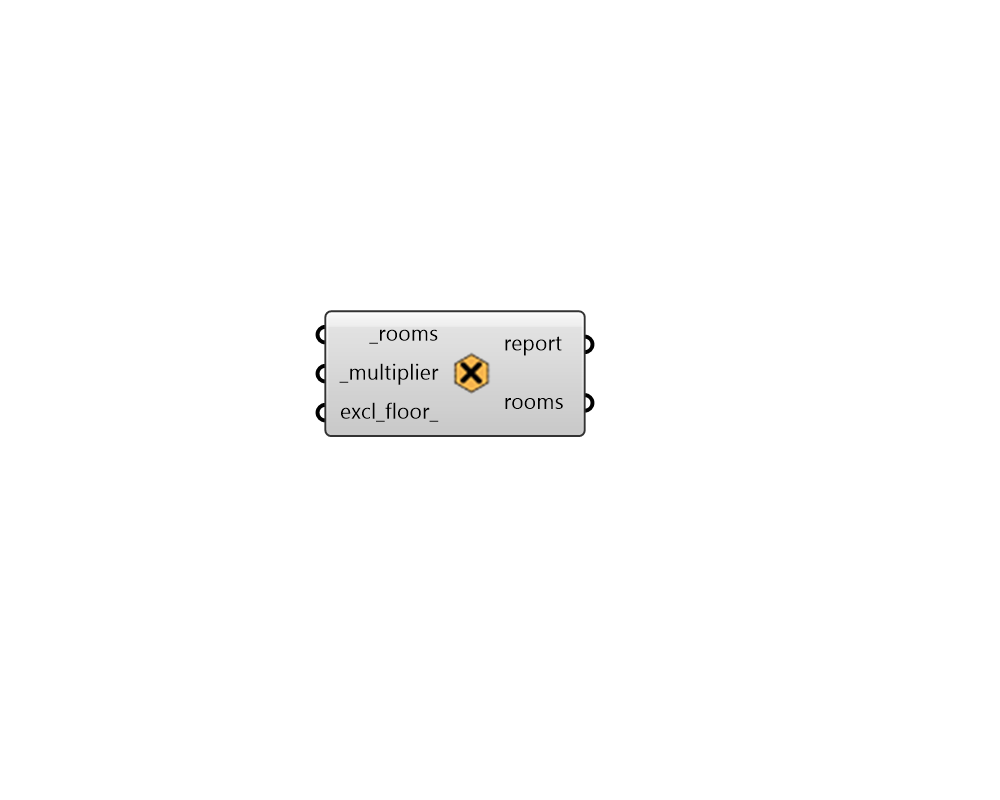

## Set Multiplier

 - [[source code]](https://github.com/ladybug-tools/honeybee-grasshopper-core/blob/master/honeybee_grasshopper_core/src//HB%20Set%20Multiplier.py)

Change the multiplier of a honeybee Room. 

Multipliers are used to speed up the calculation when similar Rooms are repeated more than once. Essentially, a given simulation with the Room is run once and then the result is multiplied by the multiplier. This means that the "repetition" isn't in a particular direction (it's essentially in the exact same location) and this comes with some inaccuracy. However, this error might not be too large if the Rooms are similar enough and it can often be worth it since it can greatly speed up the calculation. 

#### Inputs
* ##### rooms [Required]
Honeybee Rooms to which the input _multipier should be assigned. 
* ##### multiplier [Required]
An integer noting how many times the Rooms are repeated. This can also be an array of integers, which align with the input _rooms and will be matched to them accordingly. 
* ##### excl_floor 
Boolean to indicate whether the floor area of the room is excluded from the Model it is a part of. Note that this will not affect the floor_area property of this Room but it will ensure the Room's floor area is excluded from any calculations when the Room is part of a Model and when it is simulated in EnergyPlus. 

#### Outputs
* ##### report
... 
* ##### rooms
The input Rooms with their multipliers edited. 