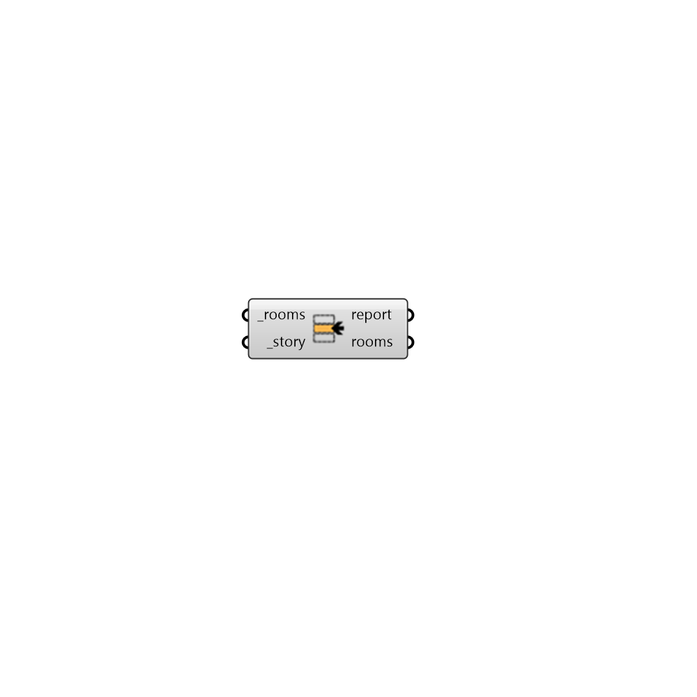

## Set Story

 - [[source code]](https://github.com/ladybug-tools/honeybee-grasshopper-core/blob/master/honeybee_grasshopper_core/src//HB%20Set%20Story.py)

Set text for the story identifier for honeybee Rooms. 

Rooms sharing the same story identifier are considered part of the same story in a Model. 

#### Inputs
* ##### rooms [Required]
Honeybee Rooms to which the input _story should be assigned. 
* ##### story [Required]
Text for the story identifier to which the rooms belong. 

#### Outputs
* ##### report
... 
* ##### rooms
The input Rooms with their stories set. 