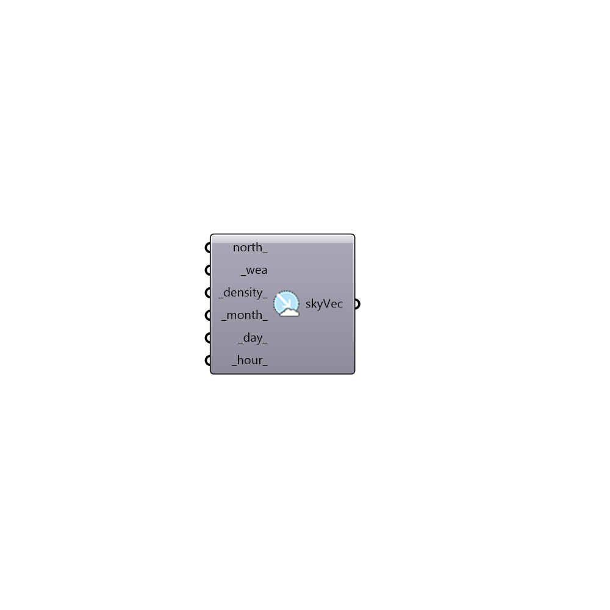

##  Sky Vector - [[source code]](https://github.com/ladybug-tools/honeybee-grasshopper/tree/master/plugin/grasshopper/src/HoneybeePlus_Sky%20Vector.py)

Sky Vector.
 -

#### Inputs
* ##### north [Optional]
Script variable skyVector
* ##### wea [Required]
Full filepath to a weather file.
* ##### density [Default]
A positive intger for sky density. [1] Tregenza Sky,
 [2] Reinhart Sky, etc. (Default: 1)
* ##### month [Default]
Input a number to indicate month (1..12) (default: 6).
* ##### day [Default]
Input a number to indicate day (1..31) (default: 21).
* ##### hour [Default]
Input a number to indicate hour (0..23) (default: 12).

#### Outputs
* ##### skyVec
Sky vector for multi-phase daylight analysis.

[Check Hydra Example Files for Sky Vector](https://hydrashare.github.io/hydra/index.html?keywords=HoneybeePlus_Sky Vector)