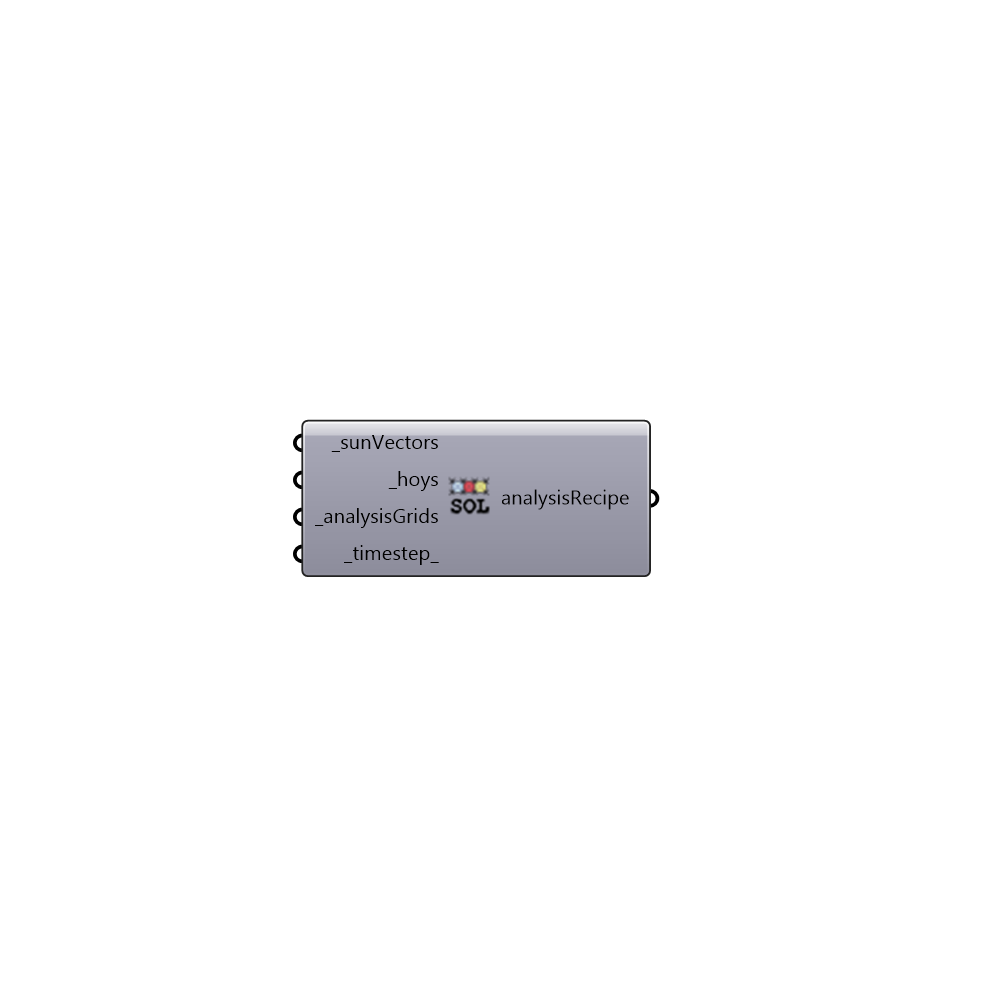

##  Solar Access Recipe

Solar Access Recipe.
 -

#### Inputs
* ##### sunVectors [Required]
A list of vectors that represents sun vectors. You can use
 Ladybug sunpath to generate the vectors for any time of the year. If
 you're generating the vectors in a different way make sure that the
 vectors are looking downwards from the sun (e.g. z < 0).
* ##### hoys [Required]
A list of hours of the year.
* ##### analysisGrids [Required]
List of honeybee analysis grids. Use Analysis grid component
 which you can find under 00 :: Create to create them.
* ##### timestep [Default]
Timstep for sun vectors. Default is 1 which means each sun vector
 represents an hour of time.

#### Outputs
* ##### analysisRecipe
Sunlight hours analysis recipe. Connect this recipe to
 Run Radiance Simulation to run a sunlight hours analysis.

[Check Hydra Example Files for Solar Access Recipe](https://hydrashare.github.io/hydra/index.html?keywords=HoneybeePlus_Solar Access Recipe)