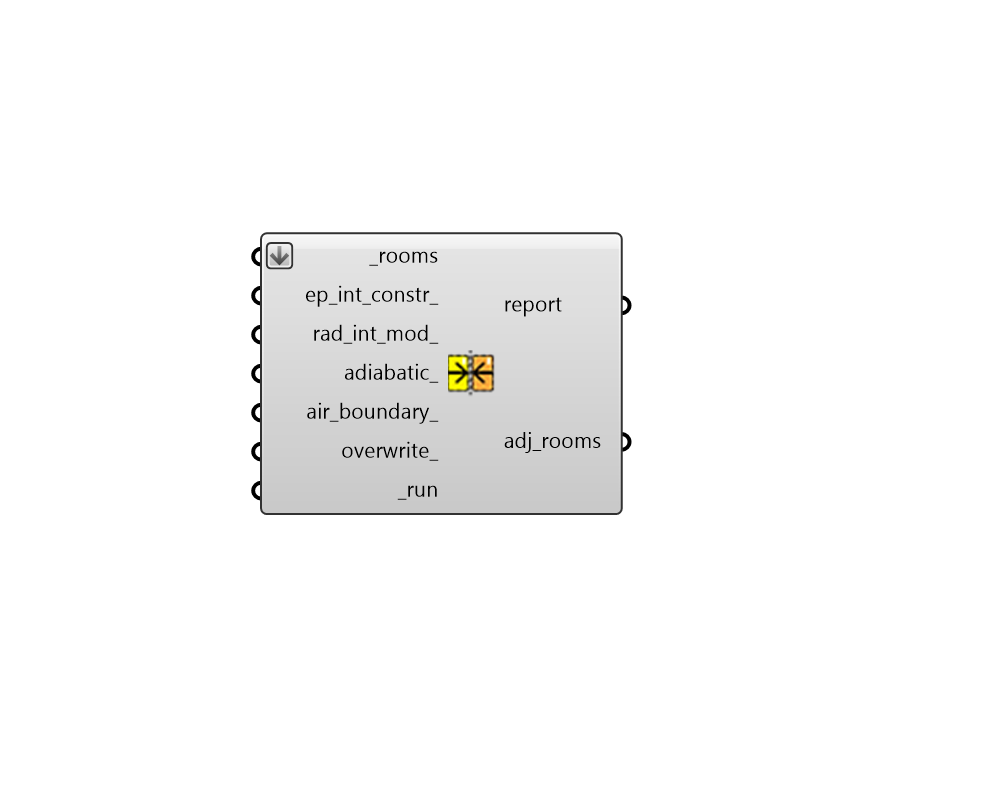

## Solve Adjacency

 - [[source code]](https://github.com/ladybug-tools/honeybee-grasshopper-core/blob/master/ladybug_grasshopper/src//HB%20Solve%20Adjacency.py)

Solve adjacencies between a series of honeybee Rooms. 

Note that rooms must have matching faces in order for them to be discovered as adjacent. 

#### Inputs
* ##### rooms [Required]
A list of honeybee Rooms for which adjacencies will be solved. 
* ##### ep_int_constr 
Optional construction subset list from the "HB Interior Construction Subset" component. This will be used to assign custom constructions for the adjacent Faces, Apertures, and Doors found in the process of solving adjacency. Note that None values in the input list correspond to constructions that will not change from the default. If no value is input here, the default interior constructions will be assigned using the adjacent Rooms' ConstructionSet. 
* ##### rad_int_mod 
Optional Radiance modifier subset list from the "HB Interior Material Subset" component. This will be used to assign custom radiance modifiers for the adjacent Faces, Apertures, and Doors found in the process of solving adjacency. Note that None values in the input list correspond to modifiers that will not change from the default. If no value is input here, the default interior modifiers will be assigned using the adjacent Rooms' ModifierSet. 
* ##### adiabatic 
Set to True to have all of the adjacencies discovered by this component set to an adiabatic boundary condition. If False, a Surface boundary condition will be used for all adjacencies. Note that adabatic conditions are not allowed if interior windows are assigned to interior faces. Default: False. 
* ##### air_boundary 
Set to True to have all of the face adjacencies discovered by this component set to an AirBoundary face type. Note that AirBoundary face types are not allowed if interior windows are assigned to interior faces. Default: False. 
* ##### overwrite 
Boolean to note whether existing Surface boundary conditions should be overwritten. If False or None, only newly-assigned adjacencies will be updated. 
* ##### run [Required]
Set to True to run the component and solve adjacencies. 

#### Outputs
* ##### report
Reports, errors, warnings, etc. 
* ##### adj_rooms
The input Honeybee Rooms with adjacencies solved between matching Faces. 