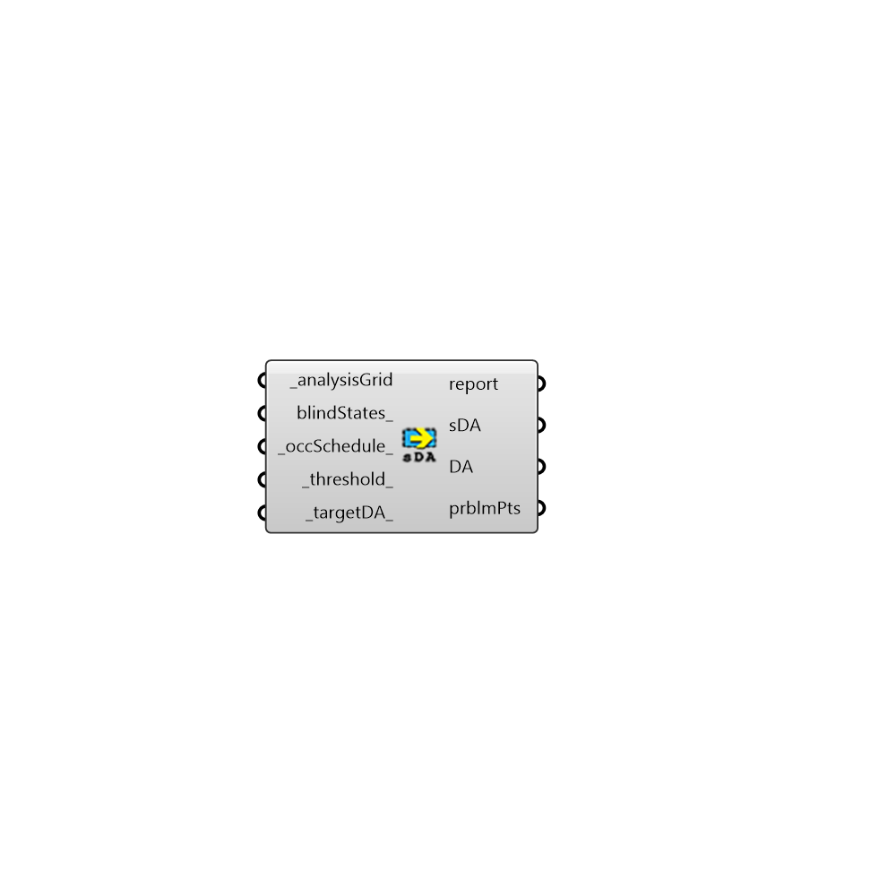

##  Spatial Daylight Autonomy

Calculate annual solar exposure (ASE).
 As per IES-LM-83-12 ASE is the percent of sensors that are
 found to be exposed to more than 1000lux of direct sunlight for
 more than 250hrs per year. For LEED credits no more than 10% of
 the points in the grid should fail this measure.
 -

#### Inputs
* ##### analysisGrid [Required]
An analysis grid output from run Radiance analysis.
* ##### blindStates [Optional]
List of state ids for all the sources for input hoys.
 If you want a source to be removed set the state to -1. ASE must
 be calculated without dynamic blinds but you can use this option
 to study the effect of different blind states.
* ##### occSchedule [Default]
An annual occupancy schedule.
* ##### threshold [Default]
Threshhold for daylight autonomy in lux (default: 300).
* ##### targetArea [Default]
Minimum target area percentage for this grid (default: 55).

#### Outputs
* ##### report
The execution information, as output and error streams
* ##### sDA
Script variable Python
* ##### prblmHrs
Problematic hours for each point.

[Check Hydra Example Files for Spatial Daylight Autonomy](https://hydrashare.github.io/hydra/index.html?keywords=HoneybeePlus_Spatial Daylight Autonomy)