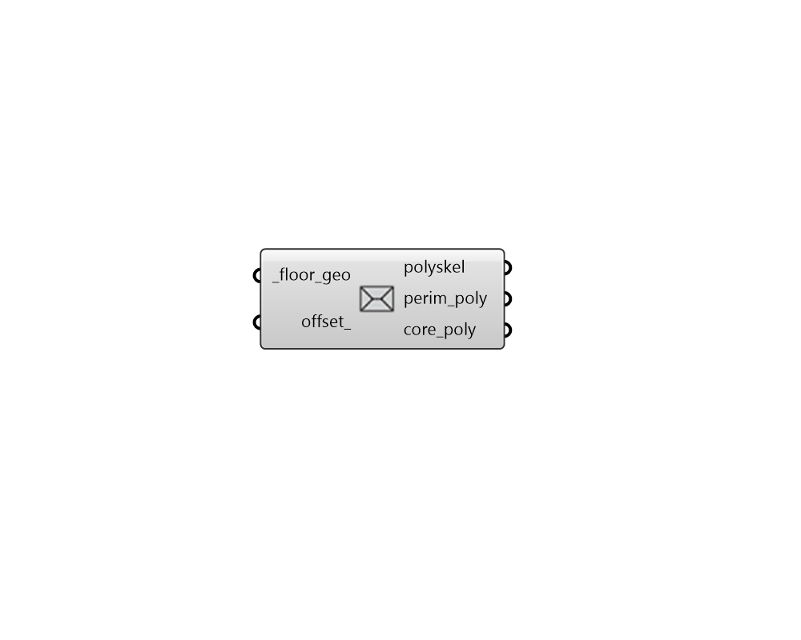

## Straight Skeleton

 - [[source code]](https://github.com/ladybug-tools/honeybee-grasshopper-core/blob/master/honeybee_grasshopper_core/src//HB%20Straight%20Skeleton.py)

Get the straight skeleton of any horizontal planar geometry. 

This is can also be used to generate core/perimeter sub-polygons if an offset is input AND the straight skeleton is not self-intersecting. In the event of a self-intersecting straight skeleton, the output line segments can still be used to assist with the manual creation of core/perimeter offsets. 

This component uses a modified version of the the polyskel package (https://github.com/Botffy/polyskel) by Armin Scipiades (aka. @Bottfy), which is, itself, a Python implementation of the straight skeleton algorithm as described by Felkel and Obdrzalek in their 1998 conference paper Straight skeleton implementation (https://github.com/Botffy/polyskel/blob/master/doc/StraightSkeletonImplementation.pdf). 

#### Inputs
* ##### floor_geo [Required]
Horizontal Rhino surfaces for which the straight skeleton will be computed. 
* ##### offset 
An optional positive number that will be used to offset the perimeter of the geometry to output core/perimeter polygons. If a value is plugged in here and the straight skeleton is not self-intersecting, perim_poly and core_poly will be ouput. 

#### Outputs
* ##### polyskel
A list of line segments that represent the straight skeleton of the input _floor_geo. This will be output from the component no matter what the input _floor_geo is. 
* ##### perim_poly
A list of breps representing the perimeter polygons of the input _floor_geo. This will only be ouput if an offset_ is input and the straight skeleton is not self-intersecting. 
* ##### core_poly
A list of breps representing the core polygons of the input _floor_geo. This will only be ouput if an offset_ is input and the straight skeleton is not self-intersecting, and the offset is not so great as to eliminate the core. 