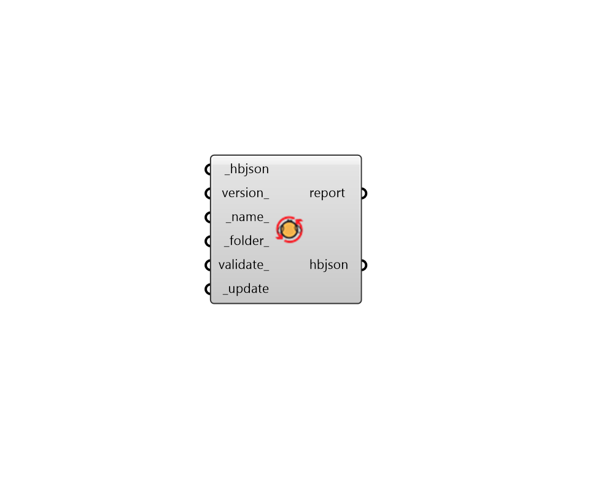

## Update HBJSON

 - [[source code]](https://github.com/ladybug-tools/honeybee-grasshopper-core/blob/master/honeybee_grasshopper_core/src//HB%20Update%20HBJSON.py)

Upgrade a Model HBJSON file to the currently installed version of the schema. 

This component can also upgrade to a specific version of the schema but it cannot downgrade the schema version or change the version of any honeybee object other than a Model. 

A full list of honeybee-schema versions can be found on the honeybee-schema GitHub: https://github.com/ladybug-tools/honeybee-schema/releases 

#### Inputs
* ##### hbjson [Required]
A file path to a Model HBJSON which will be upgraded to the currently installed version of the Honeybee Model schema (or a specific version specified below). 
* ##### version 
Text to indicate the version to which the Model HBJSON will be updated (eg. 1.41.2). Versions must always consist of three integers separated by periods. If None, the Model HBJSON will be updated to the currently installed version of honeybee-schema. 
* ##### name 
A name for the file to which the honeybee objects will be written. By default, it will have the same name as the input file but with "UPDATED" appended to the file name. 
* ##### folder 
An optional directory into which the updated file will be written.  The default is set to the default simulation folder. 
* ##### validate 
Boolean to note whether the Honeybee Model should be validated and checked for errors after it has been updated. This includes basic properties like adjacency and duplicate identifier checks as well as geometry checks for planarity, room solidity, etc. 
* ##### update [Required]
Set to "True" to update the Model HBJSON to the currently installed version. 

#### Outputs
* ##### report
Reports, errors, warnings, etc. 
* ##### hbjson
The file path to the updated HBJSON. 