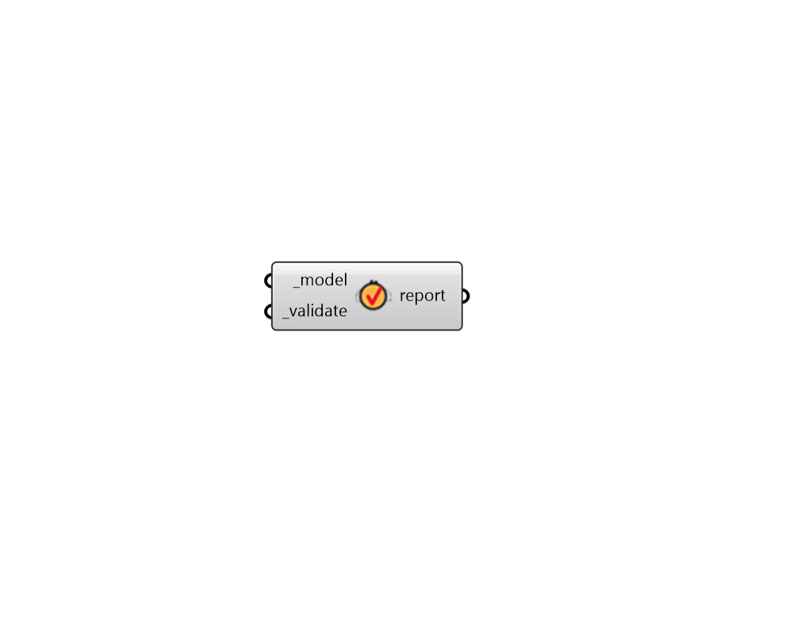

## Validate Model

 - [[source code]](https://github.com/ladybug-tools/honeybee-grasshopper-core/blob/master/honeybee_grasshopper_core/src//HB%20Validate%20Model.py)

Get a validation report that contains a summary of all issues with the Model. 

This includes basic properties like adjacency checks and all geometry checks. Furthermore, all extension attributes for Energy and Radiance will be checked to ensure that the model can be simulated correctly in these engines. 

#### Inputs
* ##### model [Required]
A Honeybee Model object to be validated. This can also be the file path to a Model HBJSON that will be validated. 
* ##### validate [Required]
Set to "True" to validate the the Model and get a report of all issues with the model. 

#### Outputs
* ##### report
A report summarizing any issues with the input _model. If anything is invalid about the input model, this component will give a warning and this report will contain information about the specific parts of the model that are invalid. Otherwise, this report will simply say that the input model is valid. 