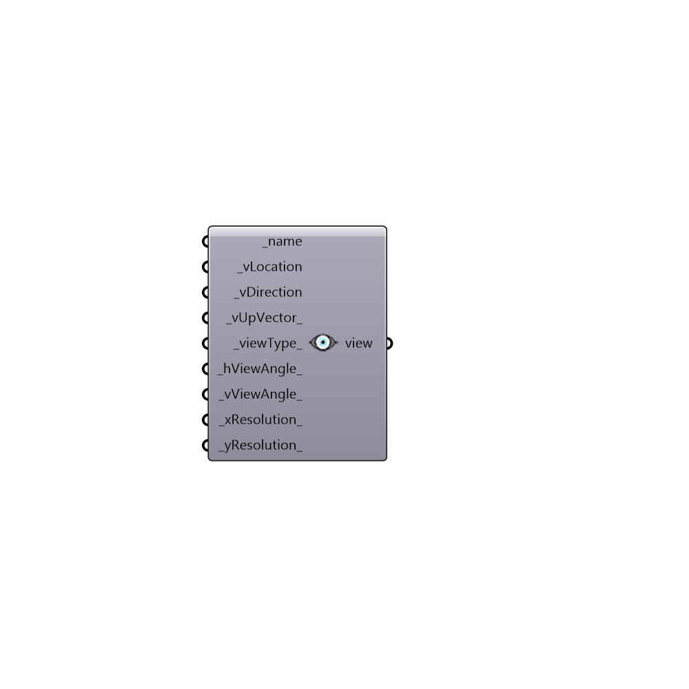

##  View - [[source code]](https://github.com/ladybug-tools/honeybee-grasshopper/tree/master/plugin/grasshopper/src/HoneybeePlus_View.py)

Honeybee View.
 -

#### Inputs
* ##### name [Required]
View name.
* ##### vLocation [Required]
Set the view point (-vp) to (x, y, z). This is the focal
 point of a perspective view or the center of a parallel projection.
* ##### vDirection [Required]
Set the view direction (-vd) vector to (x, y, z). The
 length of this vector indicates the focal distance as needed by
 the pixle depth of field (-pd) in rpict. Default: (0, 0, 1)
* ##### vUpVector [Default]
Set the view up (-vu) vector (vertical direction) to (x, y, z).
* ##### viewType [Default]
Set view type (-vt) to one of the choices below.
 0 Perspective (v)
 1 Hemispherical fisheye (h)
 2 Parallel (l)
 3 Cylindrical panorma (c)
 4 Angular fisheye (a)
 5 Planisphere [stereographic] projection (s)
 For more detailed description about view types check rpict manual
* ##### hViewAngle [Default]
Set the view horizontal size (-vs). For a perspective
 projection (including fisheye views), val is the horizontal field
 of view (in degrees). For a parallel projection, val is the view
 width in world coordinates.
* ##### vViewAngle [Default]
Set the view vertical size (-vv). For a perspective
 projection (including fisheye views), val is the horizontal field
 of view (in degrees). For a parallel projection, val is the view
 width in world coordinates.
* ##### xResolution [Default]
Set the maximum x resolution (-x) to an integer.
* ##### yResolution [Default]
Set the maximum y resolution (-y) to an integer.

#### Outputs
* ##### view
Honeybee view.

[Check Hydra Example Files for View](https://hydrashare.github.io/hydra/index.html?keywords=HoneybeePlus_View)