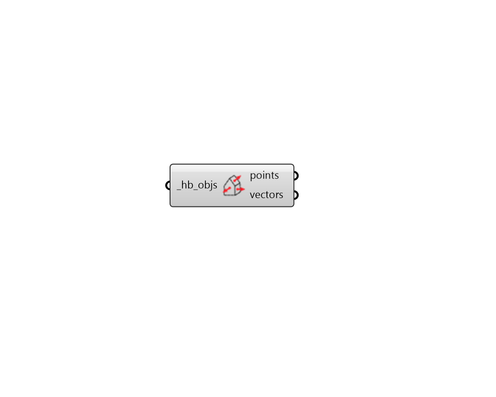

## Visualize Normals

 - [[source code]](https://github.com/ladybug-tools/honeybee-grasshopper-core/blob/master/honeybee_grasshopper_core/src//HB%20Visualize%20Normals.py)

Get aligned points and vectors to preview the normal direction of any Honeybee geometry object the Rhino scene, including all sub-faces and assigned shades. 

#### Inputs
* ##### hb_objs [Required]
A Honeybee Model, Room, Face, Shade, Aperture, or Door for which points and vectors will be output in the Rhino scene to show the object's orientation. 

#### Outputs
* ##### points
Points that lie at the center of each surface of the connected _hb_objs. These should be connected to the "Anchor" input of a native Grasshopper "Vector Display" component. 
* ##### vectors
Normal vectors for each surface of the connected _hb_objs. These should be connected to the "Vector" input of a native Grasshopper "Vector Display" component. 