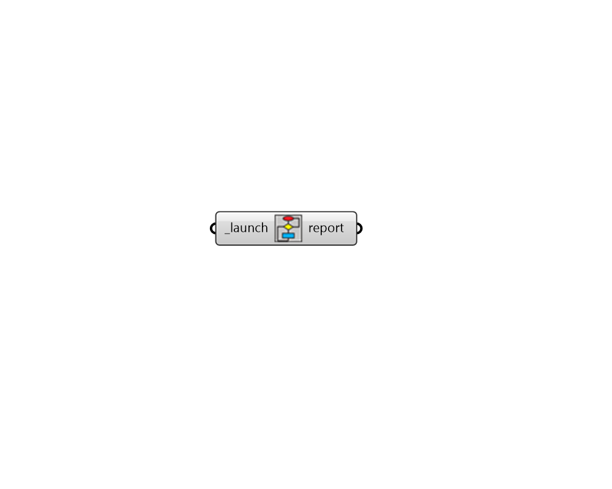

## Visualize Recipe Execution

 - [[source code]](https://github.com/ladybug-tools/honeybee-grasshopper-core/blob/master/honeybee_grasshopper_core/src//HB%20Visualize%20Recipe%20Execution.py)

Launch a browser window that can be used to visualize the execution and logs of any currently-running recipe. 

Note that this component will only open the recipe visualizer in the default browser and the page must be refreshed after starting a recipe run in order for the latest recipe execution status to be visible. 

Also note that the "Let [RECIPE NAME] Fly" task contains all of the information about a given recipe run. Selecting "View Graph" for this task and then un-checking "Hide Done" will allow one to see the full progress of the recipe. 

#### Inputs
* ##### launch [Required]
Set to True to run the component and launch a browser window that visualizes recipe execution steps. 

#### Outputs
* ##### report
Reports, errors, warnings, etc. 