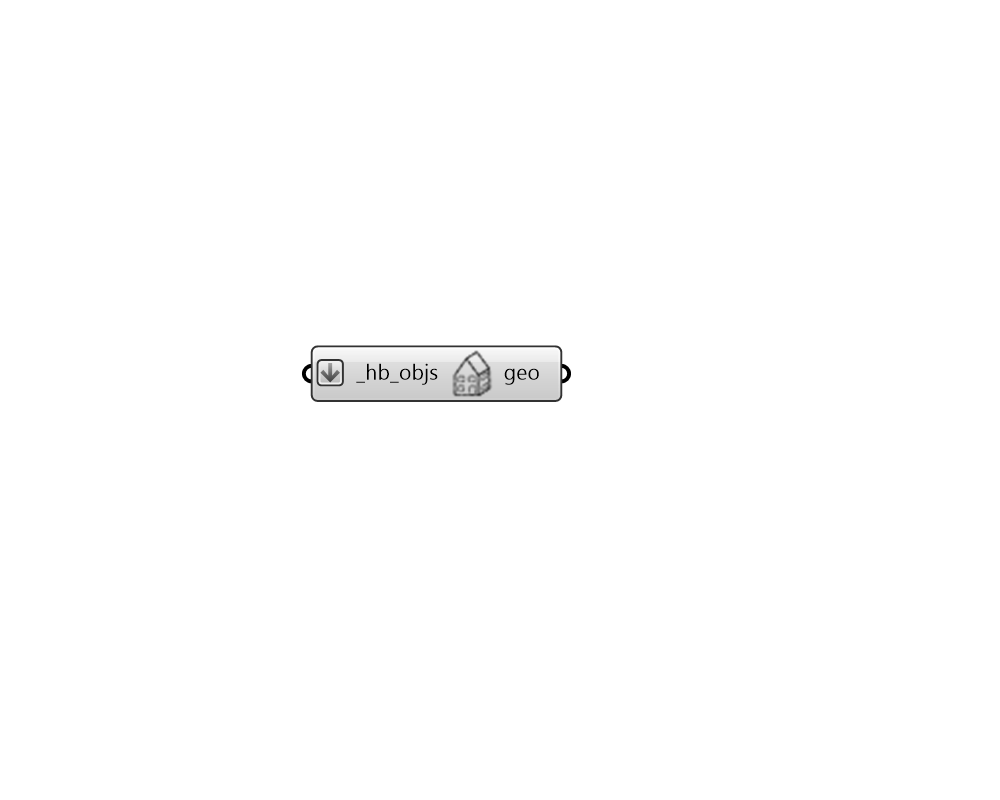

## Visualize Wireframe

 - [[source code]](https://github.com/ladybug-tools/honeybee-grasshopper-core/blob/master/honeybee_grasshopper_core/src//HB%20Visualize%20Wireframe.py)

Quickly preview any Honeybee geometry object as a wire frame within the Rhino scene, including all sub-faces and assigned shades. 

#### Inputs
* ##### hb_objs [Required]
A Honeybee Model, Room, Face, Shade, Aperture, or Door to be previewed as a wire frame in the Rhino scene. 

#### Outputs
* ##### geo
The Rhino wireframe version of the Honeybee geometry object, which will be visible in the Rhino scene. 