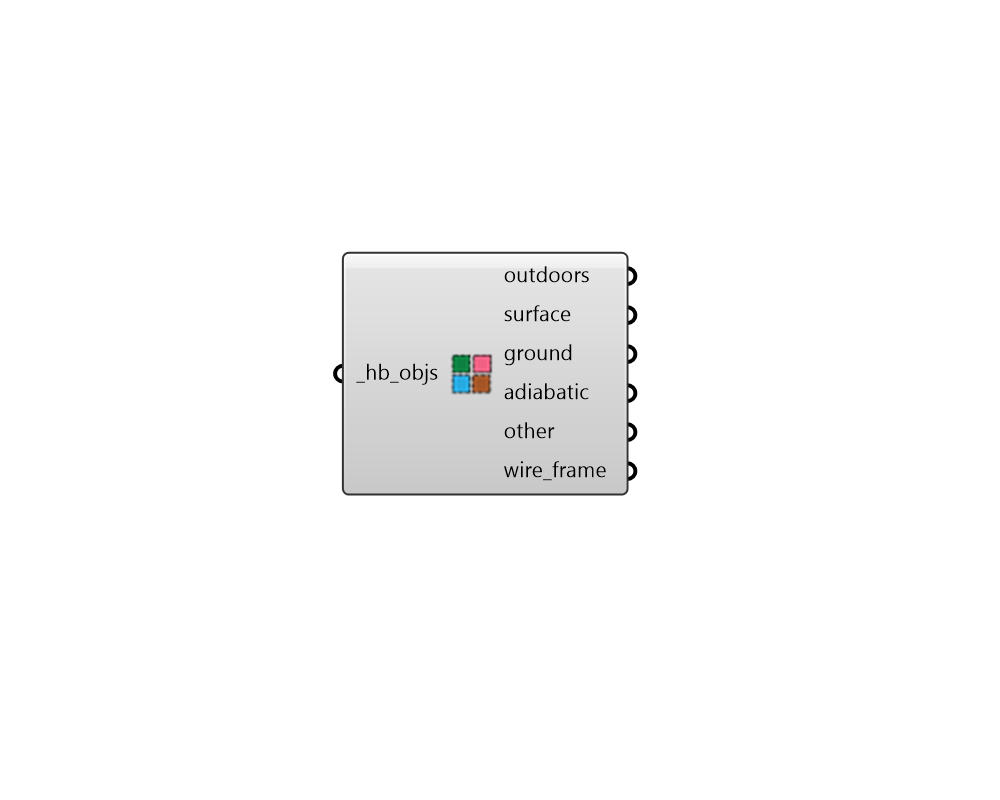

## Visualize by BC

 - [[source code]](https://github.com/ladybug-tools/honeybee-grasshopper-core/blob/master/honeybee_grasshopper_core/src//HB%20Visualize%20by%20BC.py)

Visualize room geometry in the Rhino scene organized by boundary condition. 

#### Inputs
* ##### hb_objs [Required]
A Honeybee Model, Room, Face, Aperture, Door or Shade to be previewed in the Rhino scene based on boundary condition. 

#### Outputs
* ##### outdoors
Rhino geometry for the objects with an Outdoors boundary condition. 
* ##### surface
Rhino geometry for the objects with a Surface (interior) boundary condition. 
* ##### ground
Rhino geometry for the objects with a Ground boundary condition. 
* ##### adiabatic
Rhino geometry for the objects with an adiabatic (no heat flow) boundary condition. 
* ##### other
Rhino geometry for all objects with a boundary condition other than the four above. All shade geometry will also be added to this list. 
* ##### wire_frame
A list of lines representing the outlines of the rooms. 