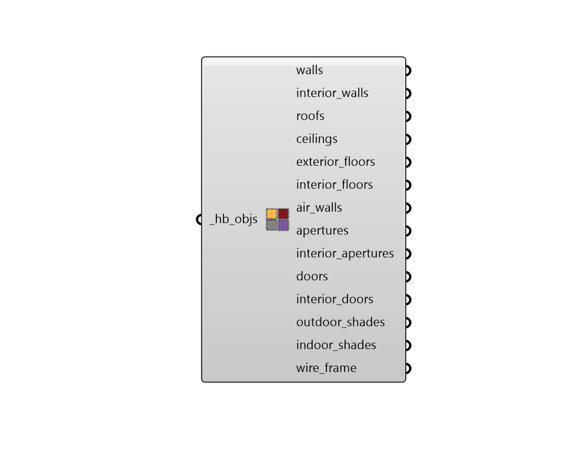

## Visualize by Type

 - [[source code]](https://github.com/ladybug-tools/honeybee-grasshopper-core/blob/master/ladybug_grasshopper/src//HB%20Visualize%20by%20Type.py)

Visualize room geometry in the Rhino scene organized by object and face type. 

#### Inputs
* ##### hb_objs [Required]
A Honeybee Model, Room, Face, Aperture, Door or Shade to be previewed in the Rhino scene based on type. 

#### Outputs
* ##### walls
Rhino geometry for the Walls with an Outdoors or Ground boundary condition. 
* ##### interior_walls
Rhino geometry for the Walls with a Surface or Adiabatic boundary condition. 
* ##### roofs
Rhino geometry for the RoofCeilings with an Outdoors or Ground boundary condition. 
* ##### ceilings
Rhino geometry for the RoofCeilings with a Surface or Adiabatic boundary condition. 
* ##### exterior_floors
Rhino geometry for the Floors with an Outdoors or Ground boundary condition. 
* ##### interior_floors
Rhino geometry for the Floors with a Surface or Adiabatic boundary condition. 
* ##### air_walls
Rhino geometry for the AirWalls. 
* ##### apertures
Rhino geometry for the Apertures with an Outdoors boundary condition. 
* ##### interior_apertures
Rhino geometry for the Apertures with a Surface boundary condition. 
* ##### doors
Rhino geometry for the Doors with an Outdoors boundary condition. 
* ##### interior_doors
Rhino geometry for the Doors with a Surface boundary condition. 
* ##### outdoor_shades
Rhino geometry for the Shades assigned to the outdoors of their parent objects. This also includes all orphaned shades of a model. 
* ##### indoor_shades
Rhino geometry for the Shades assigned to the indoors of their parent objects. 
* ##### wire_frame
A list of lines representing the outlines of the rooms. 