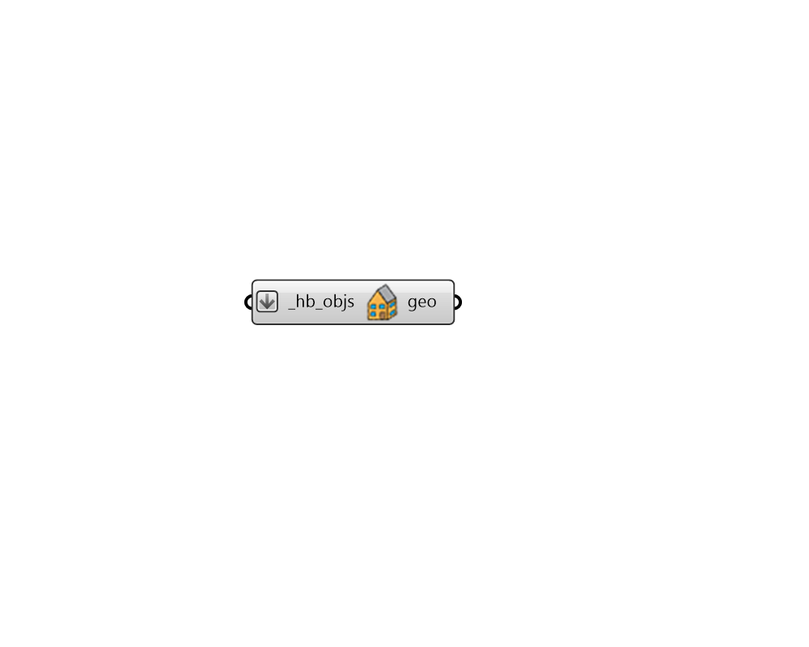
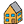

## Vizualize All

 - [[source code]](https://github.com/ladybug-tools/honeybee-grasshopper-core/blob/master/honeybee_grasshopper_core/src//HB%20Vizualize%20All.py)

Preview any Honeybee geometry object within the Rhino scene, including all sub-faces and assigned shades. 

#### Inputs
* ##### hb_objs [Required]
A Honeybee Model, Room, Face, Shade, Aperture, or Door to be previewed in the Rhino scene. 

#### Outputs
* ##### geo
The Rhino version of the Honeybee geometry object, which will be visible in the Rhino scene. 