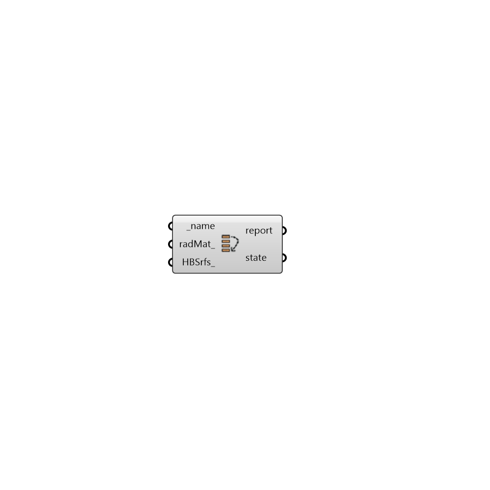

##  WindowGroup State

Window Group State
 -

#### Inputs
* ##### name [Required]
A name for this surface. If the name is not provided Honeybee will
 assign a random name to the surface.
* ##### radMat [Optional]
A Radiance material. If radiance matrial is not provided the
 component will use the type to assign the default material
 (%60 transmittance)for the surface.
* ##### HBSrfs [Optional]
A list of honeybee surfaces that will be added to the scene at this
 state. You can use this input to add radiance geometries to the scene at
 this state.

#### Outputs
* ##### report
Reports, errors, warnings, etc.
* ##### state
A Honeybee SurfaceProperties object for define a state for a
 honeybee surface.

[Check Hydra Example Files for WindowGroup State](https://hydrashare.github.io/hydra/index.html?keywords=HoneybeePlus_WindowGroup State)