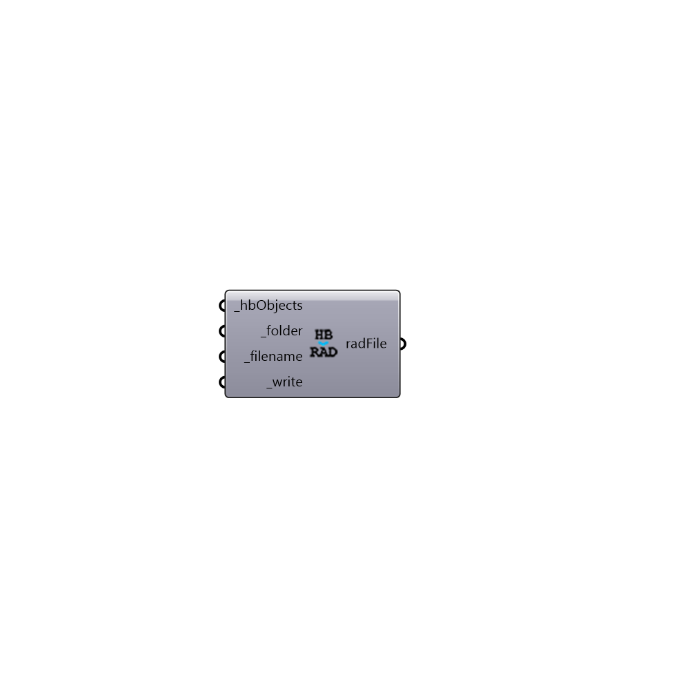

##  Write HBObjects to Radiance

Write honeybee objects to a Radiance file.
 -

#### Inputs
* ##### hbObjects [Required]
A list of honeybee objects.
* ##### folder [Required]
Path to targert folder (e.g. c:\ladybug\context).
* ##### filename [Required]
File name as a string.
* ##### write [Required]
Set to True to write the file.

#### Outputs
* ##### radFile
Fullpath to the radiance file. Use this file to create a radiance
 scene.

[Check Hydra Example Files for Write HBObjects to Radiance](https://hydrashare.github.io/hydra/index.html?keywords=HoneybeePlus_Write HBObjects to Radiance)